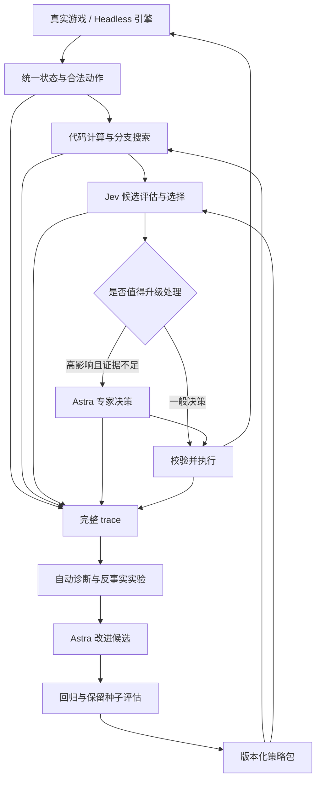

# Astra × Jev × Slay the Spire 2：设计讨论稿

调研日期：2026-09-22。状态：方案讨论，尚未实现游戏控制器、模拟搜索或自改进循环。

## 已达成的目标共识

- 胜率优先；尽量节省 Astra token，但允许关键决策调用 Astra。
- 允许利用游戏内部状态，追求最强通关。
- 从一开始覆盖多个角色和高进阶。低难度只作为定位问题的辅助环境。
- 每步保留 trace，利用复盘改进系统。
- “每轮”具体复盘粒度仍可讨论；本稿建议每整局生成报告，按问题价值触发 Astra 分析。

这里的目标是学习更强的决策系统。读取内部信息、分支模拟和训练重放有帮助；改变正式对局的 HP、奖励或胜利标记不构成决策能力提升。正式评估采用固定规则的单次完整 run，训练重放另外计数。

## 已核实的事实

### 本地连接

- 本机 `http://127.0.0.1:8080/health` 返回 STS2-Agent 0.15.0、游戏 v0.111.0、ready。
- MCP 已启用；直接 JSON-RPC initialize 与 tools/list 成功，列出 14 个工具。
- 用桌面应用自带的 Codex CLI 将 `sts2` 添加至用户级 MCP 配置，并读回确认 URL 为 `http://127.0.0.1:8080/mcp`。
- 当前任务的工具清单未热加载该服务；配置成功不等于当前会话已自动出现工具。后续可在 MCP 设置重新连接；运行器可直接使用 HTTP。
- 只读取了当前局面，没有执行任何游戏动作。
- 已找到本机 Steam 游戏 DLL；PATH 中未找到 dotnet，尚未构建 headless 环境。

Codex 配置依据：[官方 MCP 文档](https://learn.chatgpt.com/docs/extend/mcp)。

### Jev

- Jev 是结构化决策模型，支持 Choice、Score、Noul。不能把它当作能自由写代码、解释、制定任意文本计划的聊天模型。
- OpenRouter 提供 `POST https://openrouter.ai/api/v1/systemone`；指定 `typesafe/jev-1.13`，输入 `state` 和 `questions`。
- 可将同一状态下的多个独立问题合并请求；依赖前一个答案或下一步实际游戏状态的问题仍需分阶段。
- Choice 的 probabilities/confidence 表示选项分布及集中程度，不等于通关概率，更不等于候选动作的价值差。
- 当日价格：输入 $0.042 / 百万 token，输出 $0；上下文 32K。应以实际 usage.cost 对账。
- 做了一次合成局面测试：在“明确击杀存活”和“明确防御后死亡”之间选前者，同时正确识别后者会死亡。463 输入 token、48 输出 token、费用 $0.000019446，单次端到端约 946ms。这只验证接口和简单结构化判断，不是打牌能力或延迟基准。

来源：[System One](https://docs.typesafe.ai/concepts/system-one)、[Choice](https://docs.typesafe.ai/primitives/choice)、[Confidence](https://docs.typesafe.ai/confidence)、[OpenRouter 接入](https://openrouter.ai/docs/guides/community/typesafe-sdk)、[定价](https://openrouter.ai/typesafe/jev-1.13)。

### 可复用的游戏基础设施

STS2-Agent 已有状态、合法动作描述、元数据、按场景策略、决策日志、SSE 事件流，以及同一次状态构建的 `/decision-snapshot`。原生 MCP 和 HTTP 可服务不同用途：Codex 用 MCP 调试，常驻运行器直接读写 HTTP。

其日志主要记录被接受动作；外部调用的模型 usage 不会由它完整代记，且不包含完整候选集合、模拟结果、失败请求和前后状态。因此仍需自己的 trace。该项目的离线 decision benchmark 只有 11 个结构化案例，明确不评估状态转移和实际胜率。

检查的源码中，紧凑抽牌堆会合并并排序；不能把返回数组顺序当成真实抽牌顺序。现有 API 中未确认完整 RNG 导出、任意战斗状态克隆或 simulate(action) 接口。使用内部信息的授权，不会自动补齐这些能力。

参考：[STS2-Agent](https://github.com/CharTyr/STS2-Agent)、[HTTP API](https://github.com/CharTyr/STS2-Agent/blob/main/docs/api.md)、[benchmark 边界](https://github.com/CharTyr/STS2-Agent/blob/main/docs/decision-benchmark.md)。检查 commit：`a3ed158801b1cf00e8585d6a945b1e65d567d35c`。

`wuhao21/sts2-cli` 是值得优先验证的模拟基础：加载真实 `sts2.dll`，用无图形环境驱动引擎，声明支持五个角色；上游记录了 macOS ARM64 / v0.111.0 兼容性检查。其 25 局检查全部正常结束但全部死亡，证明的是可运行性，不是策略强度。

源码可见 start_run、action、load_save、场景构造和动作重放。尚未确认任意战斗中状态能够完整导入、快速复制，以及与真实窗口逐步一致。普通存档和从开局重放不能直接等同于廉价的战斗分支快照。

参考：[sts2-cli](https://github.com/wuhao21/sts2-cli)、[兼容性报告](https://github.com/wuhao21/sts2-cli/blob/main/docs/compatibility-v0.111.0.md)。检查 commit：`084d1aa3d8e118ca7ce8d8774ad16d6be9c92367`。本机尚未运行或验证该项目。

## 建议架构



常驻控制器拥有游戏循环；Astra 不逐步转发 Jev 请求。直接可证明的机械动作由代码完成。让 Jev 回答计算完之后仍需判断的问题。

### 计算、Jev 与 Astra 的分工

| 层 | 职责 | 不能假设的能力 |
| --- | --- | --- |
| 引擎/计算 | 合法性、伤害与格挡、状态转移、能量、顺序、资源变化、可复核的击杀线 | 未实现机制也可精确预测 |
| 搜索 | 生成整回合/短期候选、保留不同取舍、分支评估、缓存与剪枝 | 只搜索 Jev 第一选择就覆盖了好方案 |
| Jev | 选路、奖励、商店、构筑缺口、候选计划偏好、有限预算的搜索引导 | 会准确心算、自动发现未给出的动作组合、概率就是价值 |
| Astra | 新机制分析、高影响疑难局面、失败归因、提出代码/策略改进和验证实验 | 每次建议都正确、复盘叙事可证明因果 |

多角色共用执行和状态层，分别维护机制适配与策略参数。策略记忆应记录牌组能力、短板、下一威胁和资源预算；不把开局的构筑名称锁死为整局目标。

战斗宜选择短计划而非只挑一张牌，但执行仍逐动作校验状态。抽牌、随机效果、选牌弹窗或预测失配时重新规划。不能把旧手牌索引直接用于后续动作。

先采用有预算的短期搜索和确定性规则；能完整分支后再比较 beam search / MCTS。Jev 主要用于候选和部分搜索边界评估，不在每个模拟节点发一次网络请求。重复同一个 Jev 问题投票不能被视为独立专家集成。

### Astra 介入条件

将“分歧/未知程度”与“错误的潜在损失”一起看。两条近似等价路线的低置信度不值得升级；罕见遗物互动、可能死亡、会改变整个构筑的奖励、模拟器不覆盖的机制更值得升级。高置信度也不能覆盖计算器发现的矛盾。

优先级建议：补充缺失元数据 → 增加少量计算/搜索 → Jev 重评或另一种独立视角 → 必要时 Astra。不要让这条顺序拖延已知高影响问题。胜率优先时可以直接升级。

每次 Astra 介入既产出当前建议，也保存能迁移的适用条件和反例；经过验证后写入策略包，让类似问题下一次由代码/Jev 完成。在线与局后分析各设预算并报告，用实测胜率—耗时—Astra token 曲线选择运行点。

### Skill 的实际形态

Skill 可以承载操作流程，但日常决策应是可执行的策略包：

```text
触发条件 + 必要状态字段 + 可计算特征
+ 候选生成器 + Jev questions/criteria
+ 检索到的少量例子/反例 + 版本化参数
+ 执行后检查 + 回归局面
```

Codex 侧只需少量操作 Skill，例如运行实验、诊断 trace、提出并评估改进。Jev 每次只接收当前决策需要的策略与状态。角色、Boss 和机制知识由程序检索装配，避免每次携带一本攻略。

## Trace 与改进循环

每个决策保存：run UUID（不能只用种子，因为同一种子可能重复跑）、游戏/Mod/引擎/模型/策略版本、角色/进阶/种子、原始与归一化状态、合法动作、候选生成信息、模拟假设与覆盖范围、预测结果、完整模型请求和结构化响应、实际动作参数、响应与后继状态、耗时、usage、失败及重试记录。凭证不入 trace。

保存的是可复核的决策证据，不是 Jev 不提供的内在推理。需要玩家可读理由时，由已计算事实和所选候选生成模板说明，并明确这是程序摘要。

Astra 默认只看小型诊断包：整局结果、主要损失片段、计算预测与实测差异、策略分歧、未覆盖机制，再按需拉取原始片段。低置信片段之外，也随机抽查高置信片段和成功案例，避免只学失败故事。

先区分错误归属，再改进：

1. 信息缺失或状态归一化错误。
2. 游戏语义或计算错误。
3. 候选生成器漏掉好方案。
4. 候选已有，但 Jev 排序错误。
5. 战斗打对了，但奖励、路线或资源规划错误。
6. 动作过期、重复执行、等待或传输问题。
7. 当前证据不足，不能归因。

每局可生成报告，但不必每局修改策略。每个迭代选择一个可验证假设，提出候选改动，在旧问题和新种子上与当前版本比较，再决定晋升或回滚。优化对象首先是系统代码、问题拆分、检索、参数、示例和搜索；这不等于 Jev 权重在自我训练。

仅把旧 trace 重新交给新策略打分，是离线回归，不证明新策略实际会赢。状态分歧后需在真实引擎重放/分支，才能检验反事实结果。不能把一局死亡归因于最后一张牌，也不能把更少掉血自动视为更高通关率。

## 评估与实施顺序

从第一版建立五角色 × 目标高进阶的结果矩阵。主要指标是完整 run 胜率，分角色报告不被总体平均掩盖；同时报告决策 P50/P95、整局时长、Jev 成本、Astra token、升级率、非法动作与模拟失配率。

固定开发/验证/保留测试种子。游戏版本、解锁/初始牌组配置、Mod 和策略版本均固定；比较使用匹配种子，并报告样本数与不确定性。搜索训练与正式测试的内部信息权限一致。正式测试胜率不能混入回滚重试后的最佳结果。

推荐先做三项能够改变架构取舍的实验：

1. **引擎一致性与分支成本**：验证 headless 在本机启动，覆盖五角色；同状态同动作是否得到相同结果；能否复制战斗状态/RNG；有多少分支每秒。若不支持快速快照，先用动作前缀重放做小规模反事实，评估成本后再扩展桥接层。
2. **Jev 的实际增益**：比较代码规则、直接 Jev、代码计算后 Jev。使用包含顺序互动、长期取舍、奖励/路线的真实多角色局面；避免只测明显击杀题。测试候选顺序变化和提示措辞敏感性。证明增益后才增加更多 Jev 分工。
3. **一次完整改进闭环**：收集 trace → 定位一种具体错误 → 提出一个改动 → 旧案例回归 + 新种子对照 → 决定是否发布新策略版本。先证明可重复改进，再扩大自动改动空间。

不建议第一步从零重写全游戏模拟器，也不建议先堆很多 Jev 角色。复用真实引擎最可能缩短多角色高进阶路径，但跨界面同步、快照完整性和引擎补丁的偏差必须实测。

## 接下来值得讨论的两件事

1. 是否接受“headless 批量实验 + MCP 驱动可见游戏”作为同一套策略的两个运行后端？这关系到实验速度与开发复杂度。
2. 初期愿意给 Astra 多少探索预算，以及成熟后希望每局控制在多少 token？建议初期适度放宽，记录每次介入收益，再按结果压缩，而不先承诺一个缺乏依据的调用比例。
