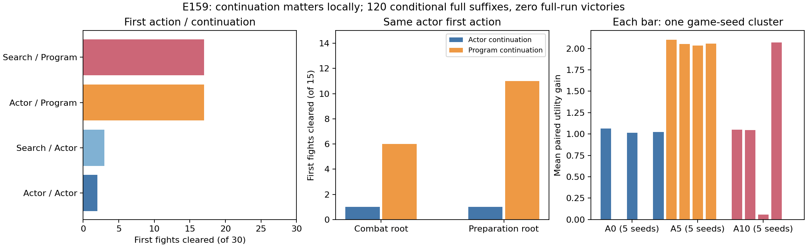

# 后续执行是明确瓶颈，战斗与整局策略需要拆开

2026-10-03；[E159 / PR307](https://github.com/yzxoi/RSI-Jev-Slay-the-Spire-2/pull/307)，承接[E149完整教师对照](2026-10-03-root-teacher.md)。

## 结果与决定

保持局面和第一步完全相同，仅把后续从冻结网络换成已有程序控制器，下一战通过由**2/30提高到17/30**，15个失败转成功、没有原成功转失败，11/15个游戏seed的平均回报提高。预注册诊断门槛全部通过。这说明后续执行是这些学生访问状态的真实瓶颈；仅搜索首步、再让弱网络完成余下过程，会限制教学信号。

仍然没有整局胜利。四组共120条恢复续局全部自然战败，一组中的一条到达第二幕。合入隔离诊断工具与证据，不改网络权重或默认实战；不将局部成功自动转为E150蒸馏许可。下一步优先执行已有[#298战斗×局外控制器完整自然局对照](https://github.com/yzxoi/RSI-Jev-Slay-the-Spire-2/issues/298)，先分清控制器的哪部分值得当教师，再注册更强搜索教师或训练实验。

## 怎样隔离变量

使用E149的全部30个TRAIN根状态，来自铁甲A0/A5/A10各5个seed。每个seed两个状态：最后一战入口与此前准备/领奖入口。它们是重复使用的困难状态，不是未见seed评测，也不是120个独立游戏seed。

将首步选择（原网络／E149已冻结的搜索选择）与后续控制器（网络／程序）做2×2，共120条完整续局。只有6根的两个首步不同，其余重复单元保留但不增加独立样本量。网络固定为E140 BC1702以维持与E149的隔离；未比较E153最新课程权重，不能把结论扩大为所有网络都不如程序。程序复用既有出牌、早用药、选牌中断处理、谨慎路线和休息规则；宏观仍有直接拿第一张奖励、离开商店等弱点，并非最优教师。卡牌/药水触发的连续选择保留来源上下文。

全部路径自然进行到game-over，同时单独冻结第一场真实战斗的结果。初始奖励或药水生成的奖励不算胜利，后续死亡也不覆盖已经完成的第一战。潜在游戏RNG保持原状态，无改血、改奖励、换seed或人工救场。

## 完整四组结果

| 第一步 | 后续控制器 | 下一战通过 /30 | 第二幕到达 /30 | 整局胜利 /30 |
| --- | --- | ---: | ---: | ---: |
| 原网络 | 网络 | 2 | 0 | 0 |
| 既有搜索选择 | 网络 | 3 | 0 | 0 |
| 原网络 | 程序 | 17 | 0 | 0 |
| 既有搜索选择 | 程序 | 17 | 1 | 0 |

“搜索选择”是E149事先冻结的结果，本轮没有重新搜索或挑选动作。换后续的作用明显大于之前换首步的作用；首步×后续平均交互项为−0.06549，不能声称旧搜索在强后续下获得了更大局部优势。

主对照固定原网络首步：死亡−1、胜利1+0.25×剩余血量比例。平均回报增量**1.03807**，15个seed聚类bootstrap的探索性95%区间**[0.62261,1.45141]**。这是效用值，不是获胜概率。A0/A5/A10各10根的下一战通过分别为0→3、0→8、2→6；三个难度均有正增量。15个独立seed与已选择的TRAIN根限制了外推，不能作为稳定整局胜率证据。

## Trace告诉我们的具体缺口

**战斗执行确实需要改进。** 固定战斗入口和首步，网络1/15、程序6/15。这里起始战斗相同，后续仍包含出牌、用药与战斗内选择，不能进一步单独归因某一项。

**奖励之后的准备与路线同样重要。** 准备入口从1/15到11/15，但其中4条程序路径把下一场精英改成了其他普通怪，另1条同名普通怪在不同楼层出现，血量和卡组也变化。下面只展示可直接从状态核对的差异；因控制器同时改变后续多步，不能将整个收益归给单次休息或选路。

| 准备状态 | 网络后续下一战 | 程序后续下一战 | 入战HP变化 |
| --- | --- | --- | ---: |
| A0-000 | 13层Bygone Effigy精英 | 14层Twig Slime＋Flyconid普通战 | 41→65 |
| A0-004 | 9层Byrdonis精英 | 9层Mawler普通战 | 37→37 |
| A5-000 | 6层Fogmog普通战 | 8层Fogmog普通战，卡组变化 | 28→52 |
| A10-000 | 7层Byrdonis精英 | 8层Fogmog普通战 | 32→58 |
| A10-001 | 9层Bygone Effigy精英 | 9层三个Inklet普通战 | 39→39 |

**全败采样不等于局面必输。** E149有18根在全部发现续演中失败，本轮其中6根改用程序后续后通过下一战。但准备路径可能换了下一战；结论是这些状态存在更好的继续方法，不是原本精英必然可打赢。

**单战目标仍不足以衡量卡组收益。** A0-000准备状态，首步Dismantle改选Sword Boomerang，再配程序后续，成为唯一进入第二幕的路径，最终死于Hive的第2层普通战。这只能作为该局面下的条件性例子，不能推导一般卡牌优劣。程序后续下两种首步的局部通过总数同为17，但整局延续不同，再次说明应保留完整局评测。

## 完整性、成本与边界

测试SHA `4d2c0ddfa6def563e177c6cce7bf39507d75a2f1`；历史游戏v0.111.0、原E158认证runtime与存档、冻结E140 BC1702网络。全部120路径与6重放在**97.816秒墙钟／155.472秒累计CPU**完成，低于600／1200秒上限。无超时、非法动作或引擎异常。

60条网络完整路径及第一战前缀与E149逐步完全一致；6条预选程序路径独立重放一致；126份原始bundle哈希审计通过。结果提交`ea19516`后，在`417913b`运行只读报告，另从wire重建120条首战的全部状态转移及终点hash，全部匹配。

9项相关合成检查覆盖选择来源、首战边界、不完整续局不能晋级、原根选择与存档契约；合成检查不代表游戏强度。原始动作和完整状态保持本地忽略，公开[协议与复现命令](../../../experiments/E159/README.md)、[结果](../../../experiments/E159/evaluation-v1.json)、[只读诊断](../../../experiments/E159/analysis-v1.json)和图表。

没有梯度更新、模型API调用或真实游戏操作；Astra开发/分析会话成本另计。已知Trial/CrystalSphere兼容缺口未触发，但仍未修复。最终330个A0～A10验收seed未使用。

## 后续路线调整

不再把“更多采样弱网络的后续”作为首选投入。程序控制器提供了明显更好的局部基线，新的搜索教师必须至少与它比较，不能只超过很弱的旧网络。

同时不直接克隆整套程序策略：现有程序宏观仍弱，本轮120条完整续局无胜利。先固定可用的较强网络checkpoint与程序基线，再用独立新seed、从开局开始，交叉“网络／程序战斗”和“网络／程序局外”，观察第一幕完成、整局胜利、资源与兼容失败。这复用独立提案#298；本轮未执行，精确输入/预算/门槛仍需先登记。

这之后再选择训练对象：如果战斗教师有效，做学生访问状态上的多轮纠错与独立验证；如果宏观仍拖累整局，先改准备/路线/选牌监督。搜索预算、教师选型和网络扩量各自需要对照，不能一次同时改变。
