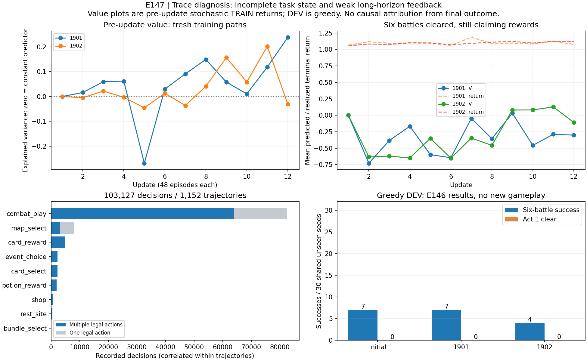

# E147：回报、动作归因与 AlphaZero 训练的差别

结论：目前更值得修的是**任务定义、网络能看到的状态，以及每个局面的训练目标**。继续扩大同一套六战 PPO，或者把旧网络直接接入更多 MCTS，都缺少收益依据。终局回报不是数学错误；我们需要更有效地从引擎获得“同一局面，不同动作会怎样”的比较。

本次只读诊断完整覆盖 E146 的 1,152 条训练轨迹、180 条 DEV 轨迹与 18 条历史验证重放，1,350 份原始 bundle、51 份引用权重/优化器文件哈希通过。重新核对了 103,127 次训练决策与实际命令、状态、所选动作概率；没有启动游戏、更新参数或消耗最终 330 个验收 seed。两 learner 共享 576 个 TRAIN 游戏 seed；DEV 是共享 30 seed，不是 180 个独立样本。[可复现证据](../../../experiments/E147/README.md)。

## 1. Trace 实际告诉了我们什么

### 六战目标遗漏了自己的进度状态

`run_env.run` 在环境包装层统计 `completed_battles`，并以 `stop_after_battles=6` 停止；这两个量没有传给 controller。`phase_encode` 也没有任务类型、剩余战数或显式难度输入。楼层/卡组等可以提供间接线索，但不是精确进度。E141 的有序牌堆和完整地图输入仍未用于本轮。

这使有限时域任务的状态表示不完整：相似的领奖局面，可能在第三战之后，也可能已完成第六战；对应的课程价值不同。代码审查能证明字段缺失，不能证明它解释了全部性能损失；需要单独消融。

一个强烈症状是：157 条成功轨迹中有 **235 次“已完成六战、还在领奖”决策**。这些决策的平均真实终局回报为 **+1.098**，当时 value 却为 **−0.318**。排除冷启动，更新 9–12 的情况仍如下：

| learner | 已六战完成后的决策数 | 平均预测 V | 平均真实回报 |
| --- | ---: | ---: | ---: |
| 1901 | 35 | −0.291 | +1.092 |
| 1902 | 53 | +0.031 | +1.116 |

这里的 V 是奖励尺度上的期望，不是胜率概率。235 次决策中有 157 次选牌、76 次领药、2 次用药，观察到 1 次 HP 变化。所有 235 次都有正的归一化 advantage。**课程终点让大多数末次领奖选择无法通过之后的战斗证明价值**；这不是完整游戏资源策略的充分训练信号。不能据此断言所有领奖动作都反事实等价，或这 235 步已被证明主导了整体失败。

### Critic 有局部学习，但不足以稳定评估长程结果

按更新前预测比较当批新鲜随机策略轨迹的真实回报，最后一批 explained variance 分别为 **0.238、−0.031**。前者已有预测信息，后者比常数预测的残差方差还差。1901 后四批为 0.058 / 0.011 / 0.118 / 0.238，1902 为 0.157 / 0.058 / 0.202 / −0.031。

全程 pooled EV 为 −0.059，但它混合不同训练阶段、策略分布与初始零 critic，**不能用这个数宣布最终 critic 完全无效**。EV 也不惩罚恒定偏移，因此报告同时保留 MSE 与相对回报均值的 R²。DEV 用贪心 actor，训练 critic 对应随机策略；两种续演不同，其误差不可混称同一校准指标。预测低于合法回报下界 −1 共 9,267 次，说明线性 value head 没有范围约束；不单凭这个数量判定 PPO 实现错误。

### 十万次决策不等于十万个独立学习信号

- 103,127 次决策中，23,604 次只有一个合法动作；真正多选动作 79,523 次。单候选 actor 梯度为零，但仍参与 critic 训练和当前 batch 归一化。
- 82,609 次属于战斗；商店只有 563 次、休息点 507 次。共享网络按 transition 混合更新，宏观阶段在样本数上很少；尚未测量梯度，不能直接断言被“梯度淹没”。
- 六战训练成功 157/1,152；A0/A5/A10 分别 100/384、44/384、13/384。A10 正反馈很少，且相同 base seed 在两 learner 中相关。
- 995 次训练死亡中，904 次最后一步只有一个合法动作。DEV 第一幕 90 次死亡中，85 次如此。最后那个 End turn 往往已经无选择；学习必须覆盖更早的状态。
- 固定的 6 条 TRAIN 轨迹重打分，24 个选牌局面中 argmax 改变 13 /10 个；486 个战斗动作局面改变 59 /58 个。网络确实改了行为；小的逐批平均 KL 不等于最终策略几乎没变。这是小型固定状态面板，不是新的强度评测。

### 两个具体例子：失败轨迹中也有好动作

原始片段、状态与 trace 哈希见 `diagnosis-v2.json` 的 `case_excerpts`；以下均为已观察的执行序列，未做新的反事实引擎试验。

**A5_04，1901 回退：首次分歧不是可证明的错误。** 原策略先 Bash 再 Defend，新策略先 Defend 再 Bash；第一回合末都剩 0 能量、5 格挡，敌人 34 HP，受击后自己 57 HP。之后选牌与出牌继续不同。原策略最后完成六战，新策略第五战后败；不能把全局回退归因给这次顺序交换。

**A10_09，1902 回退：局部明显更快，整段却失败。** 共同局面为第三回合，自己 68 HP、3 能量，敌人 13 HP。旧策略三张 Defend，下一回合才击杀；新策略连续三张 Strike，在这回合把敌人 13→7→1→击杀。两者战后均 74 HP，后续路径发生变化；最终旧策略六战成功，新策略只清四战。不能因新路径最终 −1 就把这组提前斩杀叫坏决策，也不能反过来声称它必然提高整局胜率。

这也揭示诊断方法要改进：**首次动作不同只是分叉位置，最终回报不同只是整条路径的差异；二者之间没有自动成立的单步因果关系。** 导出的观测相同也不证明完整引擎状态/RNG 相同，不能据此无条件合并搜索节点。

## 2. 现在的“回传”究竟是什么

E146 中间奖励为零，gamma=lambda=1，所以更新前的原始 advantage 实质为 `G − V(s)`（浮点实现有微小误差）：成功整段 `G=1+0.25×末端血量比例`，死亡整段 `G=−1`，然后按整批归一化，进入 PPO clipped objective。

因此同一条成功路径里的许多动作得到正向更新，即使有些只是跟随成功；失败路径中的好动作也可能收到负向信号。多次随机采样、合适的状态 baseline 能在期望意义上缓解这种方差，**这不是“PPO 错把所有动作等价”的数学定论**。问题是我们这里只有有限成功路径，任务表示又不完整，远期结果难以在动作间分辨。[GAE 原论文](https://arxiv.org/abs/1506.02438)讨论的正是长时域 policy gradient 的方差与 bias–variance 取舍；直接把 lambda 改小会更依赖当前较弱 critic，不能当万能修复。

原始负 advantage 在 batch 归一化后变正有 2,865 次。该统计是诊断信息；减去 action-independent baseline 本来就是策略梯度的常规操作，**符号翻转本身不证明 bug 或策略被错误奖励**。

还需要区分三种常被叫作“回传”的东西：游戏结果形成训练标签；搜索把叶价值向树根累积；神经网络反向传播梯度。改变其中一个不等于改变另外两个。

## 3. AlphaZero / MuZero 的关键区别

**AlphaZero 也用最终胜负训练 value。** 它在每个局面由网络先验和 value 引导 MCTS，把根节点访问分布作为策略目标 π，训练 `L=(z−v)²−Σπ(a)log p(a)+正则项`。因此同一个最终 z 可以监督沿途 value，但 actor 学的是各局面经过搜索后的动作分布。原论文正式对弈也使用搜索，不是只运行网络一次。[AlphaZero 原论文](https://arxiv.org/html/1712.01815v1)。

**MuZero 没有放弃 outcome supervision。** 它学习用于规划的 reward、policy、value 与潜状态动态；棋类使用终局结果，Atari 使用 n-step bootstrap。我们已有可验证的真实引擎，先另学一套动力学会增加误差来源，我不建议作为下一步。[MuZero 原论文](https://arxiv.org/html/1911.08265v2)。

**Reanalyse 的复用对象是局面，更新的是教学目标。** 使用较新的网络重新搜索已存局面，形成新的 policy/value targets；不只是反复模仿旧轨迹里曾选中的动作。它仍受已有数据覆盖限制，不能从没有后期状态的数据里自动创造整局能力。[MuZero Unplugged / Reanalyse](https://arxiv.org/abs/2104.06294)。

有限预算下可参考 Gumbel 根节点采样与 sequential halving，把算力集中到候选比较上；官方实现能输出改进后的 action weights。但其策略改进保证依赖正确 action values，**不能把我们的弱 value 代入就保证改善**。[DeepMind mctx](https://github.com/google-deepmind/mctx)。

STS2 还要处理观测与随机性的关系：引擎完整状态给定后可以确定，但学生未必看得到牌序/RNG；若老师搜索使用学生看不到的信息，其条件最优动作未必能被学生复现。需要输入对齐或对未知部分求期望。随机结果属于 chance transition，不能当成可选动作挑最有利结果；单人回报备份也不交替翻转符号。[Stochastic MuZero 作者说明](https://www.julian.ac/blog/2022/05/15/planning-in-stochastic-environments-with-a-learned-model/)。这些迁移建议是我们的工程推断，论文没有验证本项目。

## 4. 我建议的实现顺序与退出条件

我们以前做过搜索，因此不能把“上 AlphaZero”包装成未试过的捷径：E128 冻结网络 PUCT 比 actor 慢约 45–60 倍，未提升强度；它没有搜索目标训练。E142 选出的根动作加后续路径把 30 个已见入口的战斗胜场 6→11，E143 的 hard-BC 却只到 7，低于自模仿的 8。挑中一条好路径、构造可靠动作价值、学出独立策略是三个不同门槛。

| 顺序 | 原子提案，尚未执行 | 可证伪的问题与停止规则 |
| --- | --- | --- |
| 1 | [E148：显式任务状态与 critic 可学习性](https://github.com/yzxoi/RSI-Jev-Slay-the-Spire-2/issues/279) | 先冻结 actor，仅比较旧输入与任务/进度/难度输入的 critic；同数据、seed 划分、优化预算，对照常数及简单进度模型。两份 learner 都不能改善新 seed 校准，就不继续 PPO 加量。富观测另做消融。 |
| 2 | [E149：可靠、有限预算的根动作比较](https://github.com/yzxoi/RSI-Jev-Slay-the-Spire-2/issues/280) | 同一恢复状态、同一后续策略，对候选做多个配对续演，用均值/不确定性而非最佳路径打分；另留独立续演验证选出的动作。比较 actor、均匀 rollout 和分配预算的搜索。真实收益/延迟不通过，就不生成大批教师数据。 |
| 3 | [E150：搜索分布训练与 Reanalyse](https://github.com/yzxoi/RSI-Jev-Slay-the-Spire-2/issues/281) | 仅在老师有效后，以搜索动作分布训练 actor，保持 value 的任务语义一致；对照 hard-BC 和计算预算匹配的 PPO。分别评估纯网络和网络加搜索，不能用后者替代用户的纯网络验收。 |

E148–E150 目前只是提案；各自在运行前冻结具体 manifest、数字门槛和实现 SHA。简单的 lambda / critic 权重消融仍可作为另行注册的低成本 baseline，但不能与观测、奖励、搜索同时改后宣称找到了原因。

六战可以作为课程，但**第六战奖励卡/药水的价值必须继续到未来才有监督**。可采用不同长度的显式目标，或可靠 critic 的非终局 n-step bootstrap；不能把训练截断硬写成完整游戏胜利，也不能凭空填一个未经验证的远期 value。暂不叠加人为“好牌奖励”来遮蔽问题。

最终架构应使网络承担快速经验压缩、引擎搜索提供可检验的局面比较、真实终局校正长期目标。先证明其中一个局面改进算子便宜且有效，再证明它能被网络学会；这比先投入更大的网络或更多相同轨迹更接近当前瓶颈。
