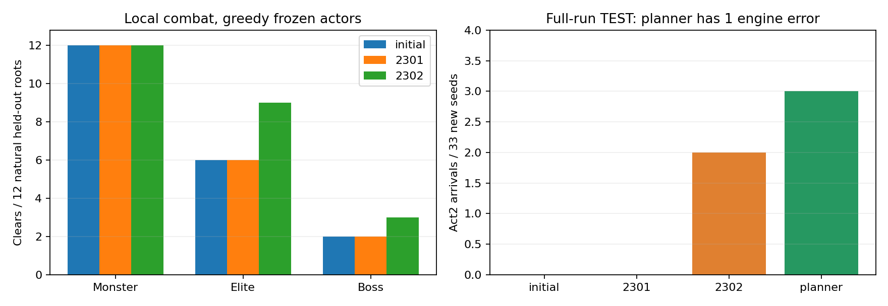
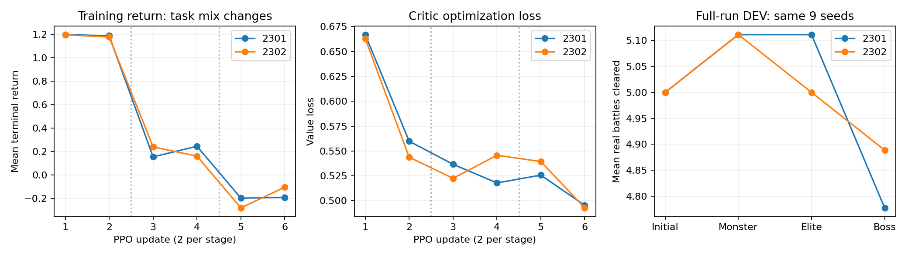

# E153：自然战斗课程与持续整局评测

已实现普通战 → 精英 → Boss 的三阶段训练，每阶段保留普通战回放；把上一战领奖、选牌、路线、休息、商店与用药接到下一场真实战斗的结果上。原游戏引擎为历史 v0.111.0，所有入口来自合法自然路径，没有修改 HP、奖励、敌人或胜利标记。这里的真实战斗指 CLI 中执行官方游戏逻辑，不是本轮启动了原生可见游戏。

## 结果与决定

| 指标 | 初始 BC | PPO 2301 | PPO 2302 |
| --- | ---: | ---: | ---: |
| 独立普通战清除 | 12/12 | 12/12 | 12/12 |
| 独立精英战清除 | 6/12 | 6/12 | 9/12 |
| 独立 Boss 战清除 | 2/12 | 2/12 | 3/12 |
| 战前准备＋Boss 清除 | 1/12 | 1/12 | 4/12 |
| 33 新 seed 进入第二幕 | 0/33 | 0/33 | 2/33 |
| 完整游戏胜利 | 0/33 | 0/33 | 0/33 |

2302 在 A2-000 与 A4-001 通过第一幕，全部动作由冻结网络选择，含局外阶段，没有教师接管。两个学习器初始权重相同、根局面与预算相同，仅采样/优化随机种子不同。2301 未复现收益，因此不能声称稳定改善。两者训练均为 93 胜、51 负，训练总成功率也不能代替泛化评测。

程序规划器对照为 32 场正常战败、1 场执行错误；3 条路径已进入第二幕，其中一条随后在 Crystal Sphere 事件因 Vector2I.One 缺失中断。不能把它计为完整战败，也没有补换 seed。完整对照执行门槛失败；即使忽略这个兼容缺口，两学习器必须同时改善的强度门槛仍失败。

**保留课程工具、兼容修复和全部证据；不推广新权重，不自动扩大本配方。** 2302 的局部和跨幕结果是值得独立复验的信号，不能据此挑它为已验证最佳模型。最终 330 个验收 seed 未使用。

## 训练与评测如何衔接

自然 TRAIN 根局面：246 普通、178 精英、28 Boss，每个配一个此前准备入口，共 904 个。DEV 另有 156 个根局面。Boss 根全部来自第一幕，精英只有 2 个第二幕入口；这是第一幕为主的课程，远未覆盖三个幕。

两个 115,778 参数 actor–critic，从 BC1702 初始化，仅清零 value head。每阶段两次更新，每次 24 条 fresh on-policy 路径，共 288 条、5,430 次决策。PPO 其余设置沿用 E146；没有使用失败的 E152 critic，也没有加入搜索。

每个阶段完成后，独立跑相同 9 个 DEV 完整局；基线加两个学习器的三个阶段共 63 次，全部正常战败且没有第二幕。没有用这些分数挑 checkpoint。最终权重哈希提交后，才运行 33 个新 TEST seed（A0～A10 各 3 个）×4 个控制器，共 132 次完整局尝试。另有 216 场独立战斗/准备评测，以及 71 条预选独立重放。

准备课程从真正奖励边界开始，初始奖励菜单不算战斗胜利；药水中途生成的选牌菜单也不算终局。准备阶段可以自主改路线，不强迫走向参考 Boss；本次局部 DEV 的实际下一战类别恰好均与参考类别相同。战斗末次领奖成为下一条准备课程的开头，不再出现“六战后选卡却无后续用途”的终点。

图中训练回报随课程变难而下降，不能直接解释为策略退化；右图在同 9 个完整局 seed 上比较，才能检查跨阶段表现。所有阶段均没有过第一幕。

## 重要的引擎正确性发现

初次采集 90 个固定 seed 时，有 88 个正常失败和 2 个引擎错误。对比发现旧 Godot stub 缺少 SetVisible(bool)，Kaiser Crab 初始化异常后竟直接发了 100 金奖励，跳过整场 Boss；因此那条“进入第三幕”的路径无效。另一处 GetIndex(bool) 缺失阻塞 Decimillipede 最后一个节段死亡。

独立 E154 增补带调用拒绝保护的准确 ABI，让原有空 UI 分支可编译；没有改动两个游戏 DLL 或替换游戏规则。固定 90 seed 重跑后均正常战败，14 条进入第二幕、0 条进入第三幕。88 条未受影响的完整命令/状态历史逐项一致；两条修正路径分别独立重放一致。不能把兼容修复算成智能体变强。

仍有两个显式缺口：Trial 的 UI 空引用 [#294](https://github.com/yzxoi/RSI-Jev-Slay-the-Spire-2/issues/294)；最终 TEST 新发现的 Crystal Sphere 向量/小游戏兼容 [#295](https://github.com/yzxoi/RSI-Jev-Slay-the-Spire-2/issues/295)。后者的向量大小参与规则计算，不能当无关视觉函数空实现。这两项尚未修复。stderr 的同步/异步异常会使样本标为错误；成功响应本身不足以证明引擎正确。

## 留痕、成本与限制

- 初次训练完成前 48 条路径后，checkpoint 缺编码器版本导致阶段评测加载失败。修复后用相同配置重启；前 48 条完整路径和所有模型张量逐项相同。保留原失败，这 48 条重复计算不算独立数据。
- 完整训练及阶段监测 226.015 秒，最终评测 300.780 秒；两次新数据采集 91.632/83.447 秒，建库预检 19.609 秒。另有 E154 两次约 29.4/29.6 秒验证、初次中断训练、编译和只读报告；这些未隐去，不与主训练耗时混为一谈。
- 训练/评测加中断版本共 830 份原始 trace bundle 哈希审计通过。stderr 重新扫描无遗漏的未分类异常。5 项合成边界/完整性测试通过。其他采集与兼容验证审计独立记录。
- TRAIN 单条路径时间累加中约 83.3% 用于恢复，优化器合计约 1.09 秒。并行累加时间不是墙钟；本次仍用 CPU，不能据此宣称 GPU 加速收益。
- 局部每类只有 12 个新 seed 入口，完整测试每档仅 3 个 seed；这是探索性 pilot，没有充分统计功效。没有同预算重新训练的六战对照，不能把收益单独归因课程划分。
- 单战奖励仍偏向当前剩余 HP，没有解决药水跨层价值；训练只有 5 次商店决策。局外长期信用、第二/三幕覆盖和学习器稳定性仍是明确缺口。

复现与完整输入/权重/trace 哈希：[E153](../../../experiments/E153/README.md)。兼容实验：[E154](../../../experiments/E154/README.md)。原始权重与 trace 留在忽略的本地 artifacts/runs；公开文件仅保留可审查结果与哈希。

## 后续更正：Crystal Sphere 为旧问题复发

2026-10-03战略复核发现，E037/#64在E033后已经登记相同的Vector2I.One与真实棋盘适配缺口。上文“新发现”是当时判断，现予更正：E156/#295已关闭为重复，保留E153新trace并回链[原始#64](https://github.com/yzxoi/RSI-Jev-Slay-the-Spire-2/issues/64)。缺口仍未修复，E153完整对照仍不完整，任何指标或门槛均未改变。
