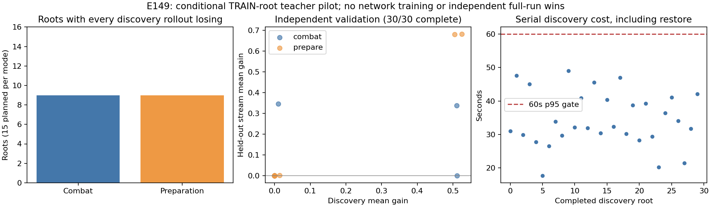

# 重复续演教师：局部有收益，覆盖与整局迁移仍不足

2026-10-03；[E149 / PR301](https://github.com/yzxoi/RSI-Jev-Slay-the-Spire-2/pull/301)、[E157 / PR303](https://github.com/yzxoi/RSI-Jev-Slay-the-Spire-2/pull/303)、[E158 / PR305](https://github.com/yzxoi/RSI-Jev-Slay-the-Spire-2/pull/305)。这是对[阶段路线](2026-10-03-strategic-review.md)的实际推进，没有训练新权重或改变默认实战策略。

## 结论与决定

可靠恢复已经落地，教师也终于完整测完。搜索能改善少数局面的出牌与奖励选择，但尚不足以提供覆盖广、可持续的策略改进信号。预注册门槛要求至少5个种子获益，实际只有4/15，故教师总门槛失败；E150蒸馏继续等待。不能把门槛失败理解成毫无收益，也不能为继续扩训把门槛改成4个。

最直接的下一步是固定同一局面与首步动作，只替换后续控制器，检验弱执行是否掩盖动作质量。[E159 / #306](https://github.com/yzxoi/RSI-Jev-Slay-the-Spire-2/issues/306)已登记但未执行；更大网络、更多PPO或同配方搜索量均未启动。最终330个验收seed保持未使用。

## 实际测了什么

冻结E140 BC1702网络（115,778参数），自然玩15个新TRAIN seed：铁甲战士A0/A5/A10各5个，覆盖所有遇到的决策阶段。这15局全部自然战败、无Boss入口；从每局提取最后一战入口及此前奖励准备状态，共30根状态。它们是刻意选取的学生失败前状态，全部第一幕，含普通与精英；不是代表性胜率样本，也不是30个独立seed。

每根最多4个候选：网络首选、简单程序建议、合法结束回合/跳过奖励，以及其余高概率动作补足。每候选4次采样续演，按平均真实下一战回报选择；另用6组未参与选择的共同随机流比较所选动作与网络动作，并各做一次贪心单战、一次贪心完整局续演。只强制第一步，之后由同一冻结网络执行。两臂的候选与后续采样共享预先固定随机数，但不同路径可能在不同决策阶段消耗它们。

回报为死亡−1、下一场真实战斗胜利1+0.25×剩余HP比例；奖励领取状态本身不是胜利。游戏潜在状态/RNG固定，采样的是后续策略随机性，不能解释成未知抽牌分布。药水、卡组、金币另外记录；这不是整局价值函数或穷尽搜索。

## 完整结果

v3测试SHA `b58a88c2cf5f8cfa261592a463c9f2a5ff85c553`，全部936条续演完成，无引擎异常或超时，18,168次后续动作。586.240秒墙钟、1,010.542秒累计CPU；30根搜索耗时p95为47.330秒，包含恢复，满足原60秒门槛。无模型API调用；开发与分析使用的Astra会话成本未包含在游戏推理账单中。

| 指标 | 网络首步 | 搜索首步 | 含义 |
| --- | ---: | ---: | --- |
| 独立随机流下下一战通过 | 25/180 | 31/180 | 每根6次；重复续演相关，不是180独立seed |
| 贪心后续下一战通过 | 2/30 | 3/30 | 一处失败转成功 |
| 贪心完整续局进入第二幕 | 0/30 | 0/30 | 两臂均未转为过幕能力 |
| 贪心完整续局最终胜利 | 0/30 | 0/30 | 恢复续局不算新的自然整局样本 |

独立验证的平均回报增量为**0.06824**；按15个游戏seed聚类的探索性95%bootstrap区间为**[0.000069, 0.159086]**。下界仅略高于零，小样本不宜作强结论。A0/A5/A10平均增量分别为0.000104/0.204618/0；战斗/准备为0.045614/0.090868。总计6个首步变化，正收益集中在4个seed，且一个A0收益极小。效应量、非退化、完整性、时间门槛通过；覆盖门槛失败，因此整体不通过。

具体例子能说明这份证据的粒度：

- A5-000准备：Armaments改选Expect a Fight，独立下一战通过由1/6到3/6。
- A5-001战斗：先Headbutt改为先Armaments，通过1/6到2/6；贪心后续也从败变胜。
- A5-003准备：Armaments改选True Grit，通过2/6到4/6；同seed战斗入口先Breakthrough改为先Bash，通过5/6到6/6。两入口不能当两个独立seed。
- A10-003战斗：搜索发现样本通过1/4到2/4，独立验证两臂均3/6、回报完全相同。不能仅凭发现样本将它标为确定优选。

18/30根的所有发现续演都战败，战斗与准备各9根。对于这些样本，−1回报没有提供动作排序信息；它们不证明局面必输，因为候选有限、后续策略较弱、采样预算有限。当前结果更接近“有少量可恢复错误，但大部分状态缺少有用教学信号”。这是诊断性推断，尚未分离成因。

## 恢复修复与失败历史

E149 v1只完成8/30，主要在启动/完整前缀恢复时超时；调度诊断后v2以4worker重跑，同900秒上限仍只完成22/30。两次不完整结果原样保留，没有增加预算、换seed或只报告完成者。中间不同worker诊断受主机负载/时间混杂，不能把v1失败完全归因并发。

E157试图改用原生Map存档＋本场短前缀。60条正常路径与60条保存后继续路径完全一致，随后120条加载路径中却有8条不同：A0-002原本进入战斗的未知房间，加载后成为Dense Vegetation事件。可见状态hash相同不足以证明未来等价，E157证书被拒绝。

读源定位到适配器的加载流程：原存档已恢复未知房间累积概率，但为重建地图调用EnterAct时又重置为基础概率。E158仅在加载已访问地图后保留存档中的4个概率字段；未编辑存档、HP、奖励或RNG，两个游戏DLL与Godot stubs均未变。原始机制源代码与二进制保持本地不公开，只公开适配器patch。

修复后60条新正常路径、120条加载续演全部匹配，另120条计时恢复全通过，420份相关bundle审计通过。完整前缀恢复中位3.801秒，原生存档＋短前缀1.676秒；**配对加速比中位数2.118倍**，p95由6.015到2.546秒。该证书只覆盖这30根和具体runtime，不能直接推广到所有历史入口。

E149 v3通过证书校验才使用新恢复，936份trace全通过；v2已有的729条终局路径全部逐步重现。恢复累计仍占路径耗时约71.4%，速度还有优化空间；47秒p95适合此离线教师预算，不能称为实时逐步决策已经足够快。

| 阶段 | 测试SHA | 结果 | 处理 |
| --- | --- | --- | --- |
| E149 v1 | aaf71f7 | 8/30完整；320.946秒 | 保留失败，不推断全体强度 |
| E149 v2 | 85f27f3 | 22/30完整；900.016秒 | 保留截尾，转入恢复认证 |
| E157加载验证 | 0078011 | 112/120相同，8个分歧 | 拒绝证书，定位原因 |
| E158修复验证 | ae67ae2 | 60正常＋120加载＋120计时路径通过 | 限定runtime/入口可复用 |
| E149 v3 | b58a88c | 30/30完整，729旧路径一致 | 教师覆盖门槛失败，停止蒸馏 |

各轮是重复计算，不能合并当额外独立数据。E149保存[协议、每轮结果和复现命令](../../../experiments/E149/README.md)，E157保存[负证据](../../../experiments/E157/README.md)，E158保存[修复与计时](../../../experiments/E158/README.md)。只读报告运行于结果提交`7cb7ec1`；[机器可读诊断](../../../experiments/E149/analysis-v3.json)包含完整来源hash与审计。

## 下一步：先区分首步与后续执行

E159保持全部30根、原有首步选择、游戏RNG和精确恢复，做2×2：首步用原网络/本轮搜索；后续用冻结网络/冻结程序战斗与宏观控制器。既看下一战，也跟到自然game-over，不在末次奖励处止步。这样可以检验同一个选择是否因后续执行而失去价值。

所有120条续局、60条网络路径等价性、6条程序独立重放均在预先约定预算内；具体门槛见issue。即使程序后续明显更好，也只支持单独测试更强的搜索教师，不自动授权蒸馏。两种弱后续都失败同样不能证明不可恢复；再考虑前移准备入口或连续多步控制。完整自然局的战斗×宏观比较仍由独立提案[#298](https://github.com/yzxoi/RSI-Jev-Slay-the-Spire-2/issues/298)承担。

这轮没有新网络训练，没有真实游戏操作，也没有独立整局通关突破。实质进展是修正一项会污染实验的环境错误、把完整教师评测降到原预算内，并得到足以否决盲目继续蒸馏的可复核结果。
