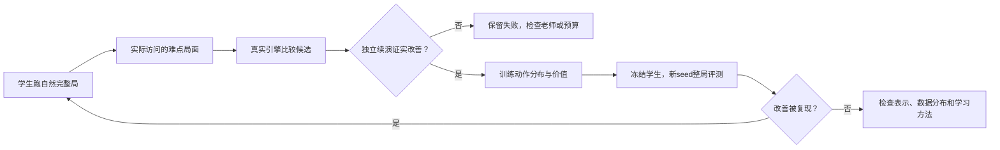

# 阶段反思：从分散试验走向可验证的策略改进循环

后续执行状态：[E149/E157/E158完整结果](2026-10-03-root-teacher.md)。恢复已修复并加速，教师有局部收益但覆盖门槛失败；下文保留当时提案，E150未启动。

日期：2026-10-03。范围：项目历史证据与后续方案设计；没有新训练、游戏动作、模型 API 请求或测试 seed 消耗。整理 issue [#296](https://github.com/yzxoi/RSI-Jev-Slay-the-Spire-2/issues/296)。

当前研究验收仍是冻结网络独立完成铁甲战士 A0～A10 整局，包含所有局外选择。原项目多角色、高进阶、低 Astra 成本目标保留；混合智能体的实用成绩与纯网络验收分别记录，不能相互替代。以下优先级是建议，不代表这些算法已实现或已通过实验。

## 1. 我们目前究竟获得了什么

| 层面 | 已有证据 | 不能推出的结论 |
| --- | --- | --- |
| 专家辅助的真实游戏 | E013 原生 A0 通关，含 213 条显式 Astra 决策；E099 的两个 A10 Boss 入口，持续 Astra 接管 2/2、Jev 自主 0/2 | Jev 低成本稳定通关，或两局 Boss 的普遍胜率 |
| 单场学习 | E133 两个新长训模型在 48 个未见困难入口分别胜 24/48、25/48，旧模型均为 18/48，规划器 25/48；A10 仍只有 2/16、3/16 | 扩训无效；也不能推出继续扩大必然解决高进阶 |
| 搜索 | E142 在 30 个训练入口，从网络 6 胜找到 11 条可胜方案；8 条有意义改善独立重放一致 | 搜索方案的起手就是无偏好动作标签；这些是已见状态的选中分支 |
| 蒸馏 | E143 教师轨迹 BC 为 7/30，自模仿 8/30；22 个新 seed 的整局对照均无胜利 | 搜索无用；证据只否定这批数据及 hard-BC 配方的扩张 |
| 价值与表示 | E152 共享属性对新 seed 的 MSE 点估计改善 12.49%/16.06%，仍输给简单进度 ridge，终点校准差 | 网络已经学会卡牌机制；critic 可以可靠指导搜索 |
| 自然课程 | E153 的 2302 精英 6→9/12、Boss 2→3/12，33 新 seed 的 Act2 到达 0→2；2301 未复现，均无整局胜利 | 稳定泛化；每档只有 3 个 TEST seed，两个优化 seed 也不足以刻画算法方差 |
| 训练环境 | E154 发现旧 CLI 跳过 Kaiser Crab 并直接发奖励；已修正。E153 恢复占累计训练路径时间约 83.3%，优化器约 1.09 秒 | 可复放就代表符合真实规则；GPU 忙起来就能明显加快整体研究 |

证据入口：[E013](../../../experiments/E013/README.md)、[E099](../../../experiments/E099/README.md)、[E133](../../../experiments/E133/README.md)、[阶段诊断](2026-10-03-rl-diagnosis.md)、[E152](2026-10-03-shared-value.md)、[E153](2026-10-03-real-curriculum.md)。各实验数据/角色/预算不同，本表不能作跨实验算法排行榜。此前 E140 也出现过个别网络通过第一幕，因此 E153 的两次过幕不是项目首次。

我的判断：项目已经证明局部决策可以改善，但尚未建立一个能够反复产生、吸收并保留这种改善的训练循环。没有证据支持把主要瓶颈简单归于 PPO、参数量或 Jev 的价格。

## 2. 对研究过程的反思

### 留痕完整，但有效知识没有充分约束后续行动

Crystal Sphere 的 Vector2I.One 错误在 E037/#64 已明确记录，E153 又遇到相同错误，我却在 E156/#295 将其称为新发现。这是执行上的疏漏。本次将 #295 关闭为重复，保留新 trace 并回链 #64；问题仍未修复。旧报告增加更正说明，不篡改原失败结果。

同样，E141 已提供更丰富的牌堆/地图观测，后面的控制实验为隔离变量保持旧编码，这在单次实验中合理；但长期没有安排受控集成，意味着“已合入能力”与“实际训练能力”逐渐分离。后续需要一张当前数据→编码→标签→训练→评测的生效配置表，以及明确的已知不支持机制清单。

### 我们还没有足够强的完整局教师

当前 `fixed_macro` 的奖励通常选首项、商店直接离开；程序规划器具有战斗用途，但不能称为强组牌与资源管理教师。网络反复模仿弱宏观策略，或者从它形成的牌组入口训练，很难自动得到高质量整局数据。另一方面，给网络更好的老师入口也会造成分布差异：自己选牌之后遭遇的局面可能不同。

这仍是待检验解释，不能由现有 trace 单独证明战斗或宏观哪个是主因。需要交叉替换控制器，而不是在一条最终失败轨迹中任意挑动作归罪。

### 局部胜利、真实教学信号和学生泛化被分开测过，但没有闭合

E142 找到可胜路径，E143 未能把收益传给网络，之后我们转向 critic、编码和课程。每一步都有理由，但“老师能改善→学生学得会→学生到达更难状态→老师继续改善”的主线始终没有完成多轮验证。

下一轮应围绕一个完整学习循环安排实验。接口正确、loss 下降、局部战斗变强、完整局通关分别是不同证据，不用增加实验编号代替能力推进。

### 小试验承受了过多决策责任

E153 的 2302 有收益、2301 没有，支持“有信号但不稳定”；不支持“自然课程无效”。E133 的胜场与均值有提升，但注册的中位数指标因大量败局为零而未通过；旧门槛应原样保留，未来应更慎重选主指标。

建议今后预先区分：探索试验用于发现效应与估计成本；确认试验扩大独立游戏 seed 和优化 seed、检查置信区间与回退；部署验收最后运行冻结模型。新协议不能事后改旧门槛，也不能将多次尝试或分支当独立 seed。小样本 RL 评估应显式保留不确定性，这是通用方法建议，不是对本项目结果的事后显著性认证。[Agarwal 等，2021](https://arxiv.org/abs/2108.13264)。

### 算力不是现阶段唯一或主要可见限制

E153 主训练和阶段评测约 226 秒、梯度更新合计约 1.09 秒。它是小型 pilot，没有认真验证大规模训练；但 E127 扩参、E133 长训也未建立高进阶优势。因此既不能宣称“RL 已经试够了”，也不能直接得出“再加 GPU 就能解决”。先度量每秒获得多少经过验证的有效转移、每个学生访问局面有多少有区分度的标签。

## 3. 四个宏观方向

### A. 建立可信且可分叉的训练环境——共同基础

目标：仿真里的提升必须来自正确规则，且分叉成本足以支持教学。

第一步是能力认证：版本绑定的机制/事件/阶段清单，战斗进入与结束、奖励生成、异步失败的语义断言，以及少量同版本原生/参考规则对照。CLI 自我重放只证明内部一致性；跨版本对照也不能直接证明错误。正式完整局遇到未支持机制仍计为执行未完成，不跳过事件、不改 HP、不换种子。

第二步才是加速：复用 E121/E132 等有证明范围的地图快照，推进已登记的 E129 warm-worker 对照；需要新的任意战斗快照时单独证明隐藏 RNG、待选牌、触发器与奖励后的续局等价。地图存档证明不能自动外推到任意动作中间状态。计量端到端有效分支/秒、p95 延迟及内存，按认证能力路由恢复方式。

第一项提案 [#297](https://github.com/yzxoi/RSI-Jev-Slay-the-Spire-2/issues/297)；加速复用 [E129/#245](https://github.com/yzxoi/RSI-Jev-Slay-the-Spire-2/issues/245)，机制修复复用 [E037/#64](https://github.com/yzxoi/RSI-Jev-Slay-the-Spire-2/issues/64) 和 [E155/#294](https://github.com/yzxoi/RSI-Jev-Slay-the-Spire-2/issues/294)，不再重复立项。

退出条件：任何状态或后续奖励不一致，不启用该恢复捷径；速度收益不足就保留已有正确路径。不能把这个方向扩大成重写整个游戏引擎的无限工程。

### B. 搜索驱动的策略迭代——建议的算法主线

目标：先让训练系统稳定找到更好的选择，再让便宜网络压缩这种能力。

从当前学生真实访问的普通/精英/Boss/奖励局面出发，在同一引擎状态上比较少量合法候选。先用最简单的多次续演均值，保持后续策略与评估规则一致，另用独立续演验证被选动作；不要挑最幸运的一条路径来当 Q 值。完整隐藏状态固定时只得到条件性能；若目标是学生不知道的随机性的期望，需要合法的一致状态分布，不能随意改 seed、把有利抽牌当成可选择动作。

教师先与 actor 比，再与等墙钟/引擎预算的均匀续演比。如果复杂分配器不胜均匀方法，就采用均匀方法；这不应否定已经证明有效的简单教师。弱 critic 不担任唯一叶估值；能真实续演的浅层判断先做清楚。

老师有效后再训练状态→动作分布，并保留任务含义一致的 value 目标。让更新后的学生重新产生访问状态、重新查询老师，逐轮减小支持。这分别借鉴 Reanalyse 的重新生成教学目标、DAgger 的学生访问分布思想；迁移到 STS2 的效果尚未验证。[Reanalyse](https://arxiv.org/abs/2104.06294)、[DAgger](https://proceedings.mlr.press/v15/ross11a.html)。

这是拟议架构，不是已跑通的 AlphaZero。复用 [E149/#280](https://github.com/yzxoi/RSI-Jev-Slay-the-Spire-2/issues/280) → [E150/#281](https://github.com/yzxoi/RSI-Jev-Slay-the-Spire-2/issues/281)。部署最终仍评纯网络；网络加搜索的强度与成本另列。

退出条件：老师未能在独立续演中改善，不大批生成标签；老师有效而学生不能复现，转向表示/蒸馏诊断；学生只改善已见根局面而完整局没有转化，不宣称循环已成立。PPO 继续作为匹配预算的对照，而不是每次默认再扩大的一条主线。

### C. 分开优化战斗与整局资源策略——解决长短期目标冲突

目标：让组牌、路线、商店、休息和用药获得跨战斗的评价，而不只追求当前战后 HP。

先做冻结控制器的 2×2 交叉：程序/网络战斗 × 规则/网络局外策略，观察主效应与交互。当前两种局外控制器都可能弱，若它们差异小，只说明这组候选不能区分，不能证明组牌不重要。战中选牌必须按触发来源归属，不能因为出现卡牌菜单就错误交给宏观控制器。[原子提案 #298](https://github.com/yzxoi/RSI-Jev-Slay-the-Spire-2/issues/298)。

有证据后再建立分层策略：战术层处理这一回合/这一战；战略层处理牌组缺口、下一精英/Boss 的准备、路线风险与药水机会成本。可以分别估计当前战斗结果、到下一关键节点的资源分布、整幕/整局存活；它们不是同一个 value 数值，也不能在没有标签时把短期 HP 伪装成长期胜率。

Astra 或人类可在训练时给战略候选与少量示范，作为经引擎检验的教师；不把固定攻略当硬标签。若短期需要可玩的混合系统，阶段接管次数/费用/延迟与胜率单独记账，不能拿混合胜利来满足纯网络验收，也不能假设 Jev 必须固定留在架构中。

退出条件：更复杂层级没有超过“固定战斗器＋简单可验证宏观策略”，保留简单方案。先定位瓶颈，不直接同时训练两个互相变化的控制器。

### D. 学习卡牌与机制的组合表示——提高学生吸收能力

目标：让模型能区分“这张牌对这个目标、在这些遗物和状态下会发生什么”。

当前身份/文本哈希与池化会丢失关系，E152 只证明共享属性有一点预测收益。候选结构是卡牌、敌人、遗物、药水分别编码，以合法动作及目标为查询建立交互；无序实体按集合处理，牌堆/法球等有语义顺序的对象必须保留顺序。Set Transformer 提供建模集合交互的架构参考，不能直接推断适用于所有游戏对象。[Lee 等，2019](https://proceedings.mlr.press/v97/lee19d.html)。

先保持策略、输入信息与训练标签固定，比较哈希/池化与实体交互表示；再另做辅助目标消融：预测真实引擎的一步伤害、格挡、能量与状态变化。这些标签用于检验机制辨识能力，并不替代游戏引擎，也不证明未来胜率可预测。动作有隐藏随机效果时要标明条件信息或预测分布，避免老师用到了学生看不见的信息。

评测按 game seed、预定组合和遭遇类型划分；单独区分新物品与旧物品新组合。E151 已显示陌生药水不是此前 critic 失败的充分解释。参数量按是否欠拟合与端到端成本决定，不预先规定必须上千万参数。[原子提案 #299](https://github.com/yzxoi/RSI-Jev-Slay-the-Spire-2/issues/299)。

退出条件：在新组合上一阶后果或动作区分都没有收益，就不接完整 PPO；如果局部机制学好但远期目标失败，转向 C 的长程监督，而不是继续单纯加宽编码器。

## 4. 推荐推进顺序与研究纪律

1. **先补 A 的有限范围认证和已知缺口管理。** 把现有可用机制/快照能力接进统一配置；不等待“所有游戏机制完美支持”才做任何研究，也不把已知不支持部分藏起来。
2. **主算法只推进 B：先 E149，老师过关再 E150。** 先证明便宜的局面改进，之后争取连续几轮的学生独立整局收益；每轮都使用预先冻结的评测规则。
3. **C 的交叉诊断用于决定资源投入位置。** 若整局主要受宏观控制器组合限制，优先强化准备；若战斗端决定上限，集中 B/D。交互强则保留联合问题，不硬分责任。
4. **D 先做离线、同数据的小对照。** 不与搜索、奖励、网络规模一起改，再归因某一个因素。

暂缓：盲目扩大同一 PPO 配方、只为了用 GPU 而扩参、尚未证明标签质量就做海量 hard-BC、已有真实引擎时另起完整 learned world model、未经全局状态等价证明就剪除所谓次优分支。现有引擎的局部规则与未来不确定性都要诚实描述；不能把这款单人游戏直接当成零和对手博弈或套用 alternating-sign backup。

每轮统一报告三组结果：学习到什么（独立动作比较/局部课程）；能否独立走得更远（冻结 actor 的完整局）；为此花了什么（合法有效转移、独立 seed、墙钟、重放占比、模型调用与失败）。固定里程碑、代码与运行环境版本，明确已启用与仅可选模块。完整胜率始终保留，但在全零阶段用预注册的过幕率及条件战斗指标诊断，而不是伪造满局奖励。

这次没有重启实验，没有改变 E133/E146/E148/E152/E153 的旧门槛或结论，没有选择 2302 替换默认策略。新提案在执行前仍需冻结数字预算、具体样本和退出标准；现有最终 330 seed 保持未使用。
