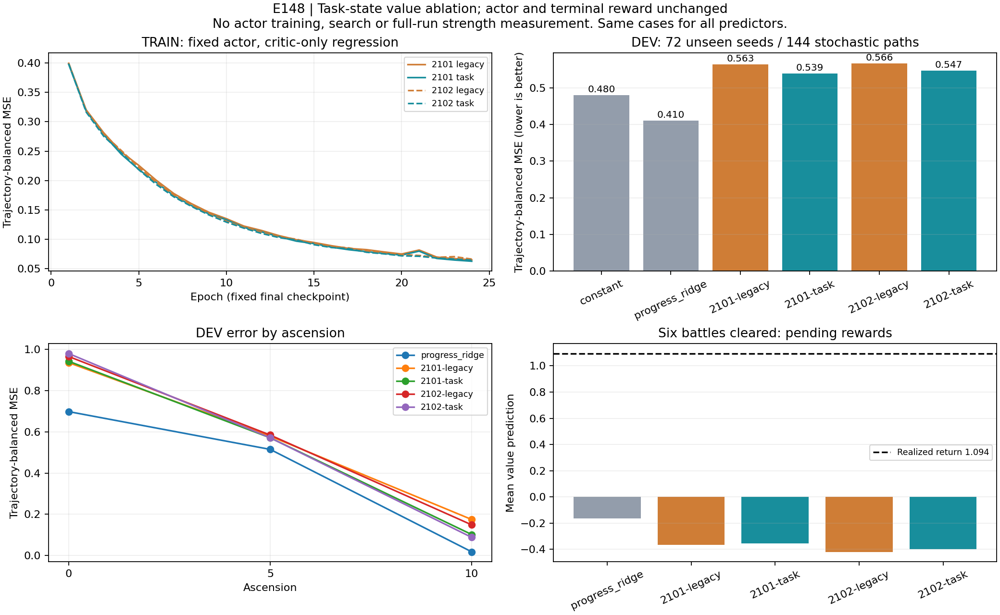

# E148：任务信息有小收益，主要暴露的是 value 泛化失败

E148 已完成。补充目标、已完成/剩余战数和难度后，两个 critic 的未见 seed 误差分别降低 **4.40% /3.51%**，但均未达到预设门槛，也均输给简单进度回归。停止这套 critic/PPO 配方的自动扩张。默认 actor 没有改变，本轮没有新的胜率提升结论。

## 实验实际做了什么

固定 E140 BC1702 的随机策略，让它自己处理战斗、奖励、选牌、用药、地图、商店和事件。重新采集 A0/A5/A10 的 288 个独立游戏 seed，每个两条固定采样路径：216 TRAIN seed/432 路径，72 DEV seed/144 路径，共 51,343 次决策。两次采样不算两个独立游戏 seed，TRAIN 与 DEV 完全分离。

每组从相同预训练 state trunk 和归零 value head 出发，使用相同 minibatch 顺序、标签、参数量和 24 个 epoch。原输入组增加五个零输入，任务组增加五个真实任务数值，各 86,529 参数；两份 shuffle seed 共四个 critic。只训练独立 critic 副本，原 actor 完全冻结。任务类型/长度固定六战，不能推出能泛化到新目标长度。

标签来自同一冻结策略的完整六战课程，而非混合历史策略：自然失败 −1，成功为 1+0.25×末端 HP 比例。每条轨迹总权重相同，不因路径更长而占更多权重。没有 TD bootstrap、shaping、policy gradient 或搜索。

另设 TRAIN-only 常数与进度 ridge 基线。后者只用阶段、难度、战数、HP 和简单交互，不使用卡组哈希。所有最终模型先提交哈希，再评分 DEV；没有按 DEV 选 epoch。[完整预注册与原始证据索引](../../../experiments/E148/README.md)。

## 结果与门槛

| 预测器 | TRAIN MSE | DEV MSE | DEV 六战结束领奖时 V |
| --- | ---: | ---: | ---: |
| 常数基线 | 0.4877 | 0.4799 | −0.733 |
| 简单进度 ridge | 0.4068 | **0.4104** | −0.165 |
| 2101 原输入 | 0.0651 | 0.5633 | −0.365 |
| 2101 补任务 | 0.0626 | 0.5385 | −0.354 |
| 2102 原输入 | 0.0663 | 0.5664 | −0.419 |
| 2102 补任务 | 0.0644 | 0.5465 | −0.397 |

DEV 末次领奖的真实平均回报为 **+1.094**；28 次决策，来自 18 条成功路径、16 个游戏 seed。两个任务组 MAE 仍为 1.448/1.491，远未达到 <=0.25 且比原输入减少一半的门槛。

补任务相对原输入的配对 MSE 差值为 −0.02479/−0.01989；按游戏 seed bootstrap 的 95% 区间为 [−0.05085,−0.00410] /[−0.04355,−0.00028]。有小收益证据，不能写成“完全无效”；但两份都未达到至少 10% 相对改善，且没有超过简单基线至少 5%。原门槛不改。

## 这次修正了我们的判断

**任务状态缺失确实值得补，但不是修完就能解决的主要障碍。** 在训练集中，补任务 critic 对六战后领奖的预测已接近正确：+1.023/+1.002，MAE 0.162/0.197；在未见 seed 上却重新落到负值。因此不能再把低估终点简单解释成“没有收到进度”。这套表示和拟合方法未能把规律泛化出去。

整体 TRAIN 误差约 0.06，DEV 约 0.54，且后者比常数基线还差。它能很好拟合已见轨迹的结果，却没有学出可靠的未见状态估值。输入敏感性检查确认任务字段已连接、会改变输出；将字段强行归零属于分布外输入，只能用于这项连接诊断，不是动作收益或胜率的因果证明。

**A10 误差下降也不能解释成更会打 A10。** 固定 actor 的 DEV 六战成功为 A0 11/48、A5 7/48、A10 0/48。改进集中在 A10；在这批全败数据里，学会预测更悲观就能降低误差。actor 根本没有训练，也没有因为 critic 变化而选择不同动作。

**长程回报噪声确实不小。** 同一初始输入的两次独立动作采样，回报差给出的初始回报方差估计为 0.43045。任务 critic 的初始状态 MSE 为 0.64531/0.63558，ridge 为 0.44913。这只适用于这些起点，有有限样本误差，不能当作所有中间状态的误差下界；但提醒我们不能把每条带终局标签的轨迹当成精确 value 真值。

简单 ridge 的整体误差更低，但也没有解决末次领奖校准。它的固定正则与稀有终点权重可能影响该指标；本轮没有调参验证，不能把它当成已经成熟的替代 critic。神经网络的过拟合也尚不能单独归因于容量、哈希表示、正则或 MC 标签噪声。

## 执行证据和下一步

全部 576 条路径完成，6 条预选独立重放一致，582 份 raw bundle 审计通过。汇总曾因相对路径处理失败；原始逐局结果和 tensors 已保存，修复后从原始 wires 重建全部 51,343 行，输入、进度、阶段和标签均逐项精确一致，tensor 哈希不变。没有为掩盖异常重跑或替换 seed。

实际对局 trace 时间跨度约 288.972 秒，恢复核对 26.458 秒，critic 训练 13.919 秒，验证 1.721 秒。异常使最初 setup/serialization 的精确总墙钟未能保存，因此保守按完整 900 秒采集额度计费，三阶段计 915.640 秒，仍在 20 分钟预算内；事后只读诊断另用 0.751 秒。工程排错时间不计为训练吞吐收益。

决定：合入隔离研究工具和正负证据，**不推广这些 critic，不把它们用于搜索叶估值，也不继续相同 PPO 加量**。最终 330 个验收 seed 未动。

下一步保留 [E149](https://github.com/yzxoi/RSI-Jev-Slay-the-Spire-2/issues/280) 的独立门槛：用真实引擎对同一状态、不同动作做重复续演，以均值和独立验证判断教师是否有真实增益，优先绕开当前失准的神经叶估值。若这个动作比较算子本身无效，就停止，而不是把噪声或幸运分支继续蒸馏。只有老师通过后才启动 [E150](https://github.com/yzxoi/RSI-Jev-Slay-the-Spire-2/issues/281)。这两项本轮尚未执行。
