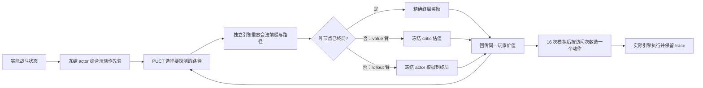

# 学习策略与价值，再用真实引擎搜索

## 2026-10-03 · D020 · 自然课程出现单学习器收益，保留完整局门槛

[E153](../../../experiments/E153/README.md)完成普通→精英→Boss和此前准备课程；两份115,778参数模型，共288新路径、5,430决策。每阶段同9seed完整局监测，最终冻结后33新seed覆盖A0～A10。2302精英6→9/12、Boss2→3/12、准备＋Boss1→4/12，完整局进入Act2由0→2/33（A2/A4）；2301无对应收益，三者整局均0胜。局部小样本只提供信号，不能判定稳定提升。

程序对照32败＋1引擎错误，不能把未完成算败。E154发现并修复Kaiser Crab被错误跳过；两个游戏DLL未改，88条历史完全一致，两条修正路径重放通过。Trial/Crystal Sphere仍有已登记兼容缺口。完整性和双学习器扩训门槛未通过，合入可选课程/证据/修复，不推广权重或扩大此配方。830份学习/评测trace审计通过，checkpoint失败与完全一致的重启保留；最终330seed未用。[结果、图与限制](2026-10-03-real-curriculum.md)。

## 2026-10-03 · D019 · 共享属性编码有收益迹象，但不推广 critic

[E152](../../../experiments/E152/README.md)：同86,529参数、同TRAIN216seed/432路径、同初始化/优化预算，只替换表示包。权重冻结后采集新72seed/144路径：共享属性MSE0.4708/0.4626对哈希0.5380/0.5511，点估计降低12.49%/16.06%；2201配对区间跨零，2202不跨零。简单ridge0.3867仍更好，A5回退37%/18%，终点MAE1.13/1.12仍远高于0.25。

决定：合入opt-in编码与完整证据，不用于默认PPO/搜索，不继续此配方扩量。输入表示值得继续研究，但没有稳定强度或终点校准证据。3独立重放、147bundle及237预选行重建一致；默认actor未改。E149真实重复续演仍为未执行的独立下一问题，E150依赖可靠教师；最终330seed未用。[完整图表与限制](2026-10-03-shared-value.md)。

## 2026-10-03 · D018 · 物品身份覆盖不是主要解释

E151事后只读审计：DEV药水全部已见，约94.5%critic误差仍落在已知物品状态；整条已知路径也未超过简单ridge。不能把E148失败简单归因新卡/新药水。后续表示修复应考察实体属性共享、交互与任务边界，但必须同数据/标签对照；新组合高占比本身不证明因果。E149继续作为真实多次续演质量检验提案，未执行；不接入失败critic作为搜索叶评估。[E151报告](2026-10-03-item-novelty.md)。

## 2026-10-03 · D017 · 任务输入小幅改善，critic 泛化门槛失败

E148固定BC actor，288新游戏seed×2采样=576路径，TRAIN432/DEV144，51,343决策。四个86,529参数独立critic，仅比较原输入与任务进度/难度输入，两份shuffle seed、同一数据/预算。先冻结最终权重，再评分72未见游戏seed；没有actor更新。

DEV MSE原输入0.5633/0.5664，补任务0.5385/0.5465，仅降4.40%/3.51%；常数0.4799，简单进度ridge0.4104。配对bootstrap支持小收益，但效果量/简单基线/终点校准三项门槛均失败。TRAIN约0.06对DEV约0.54，体现明显泛化差距。训练终点预测约+1.0，未见终点却−0.35/−0.40，对真实+1.094；仅补进度不足以解决。

A10 DEV48路径全败，误差下降主要来自更悲观的预测，不是更会通关。初始两次采样估计回报噪声0.43045，仅适用于起点。6独立重放/582bundle通过；汇总路径异常保留，重建全部输入张量逐项一致且hash不变，未重跑/换seed。训练13.919s，评分1.721s。

决定：合入隔离诊断和全部证据，不推广critic、不继续同配方PPO扩量、不用它做搜索叶估值。E149下一步需用真实重复续演先证明动作比较有效，E150仍等待教师门槛；两项本轮未执行。最终330seed未用。[完整结果与曲线](2026-10-03-task-value-pilot.md)。

## 2026-10-03 · D016 · 先修任务语义并验证局面改进，再扩大训练

E147只读覆盖E146全部1,152训练轨迹/103,127决策、180 DEV尝试；1,350份原始bundle和51份checkpoint审计通过，27.850秒，没有新游戏动作或梯度。23,604步只有一个合法动作；995次训练死亡中904次最后一步无选择。

六战已清的235次领奖决策，V均值−0.318对真实回报+1.098；最后四批仍有明显偏差。课程目标/剩余战数在环境包装器里，没有进入网络，显式难度也未输入。终点奖励卡的未来用途在六战任务中缺少后续验证。最后一批EV为0.238/−0.031：1901有学习，1902不稳定，不能以pooled负EV抹掉前者收益。

具体轨迹否定粗糙动作归因：A5_04只是先Bash/先Defend顺序不同，首回合结果相同；A10_09新策略更早斩杀且同HP离场，却在之后失败。首次分叉、整段胜负不是单步因果标签。

决定：终局回报本身保留；AlphaZero同样以最终结果训练value，关键新增是每局面的搜索策略目标。下一步依次是E148任务状态/critic可学习性、E149固定后续策略的重复动作比较、E150搜索分布蒸馏和reanalyse，均只是已登记提案。先证明搜索比同预算简单rollout有效，再训练；保留纯网络与带搜索两种独立指标。默认不变，最终330seed未用。[E147 详细诊断与 AlphaZero 对照](2026-10-03-credit-and-search.md)。

## E146 后：停止本轮 on-policy 配方加量

E145零过幕正反馈后，E146把任务缩短到六场自然战斗，并真正给路线/奖励等宏观动作分配整段回报。1,152条新轨迹、103,127动作的训练完成，30新seed六战成功为旧7/30、新7/30及4/30，完整第一幕均0/30；预注册扩张门槛失败。默认策略不变，不将此结果解释为所有on-policy算法无效。E141富输入、终点之外的资源价值及信用分配仍需分别验证，不能据此直接继续增加相同训练量。[完整结果与曲线](2026-10-03-onpolicy-pilot.md)。

## E141–E144 后的执行状态

只读观测E141与局部教师E142已经通过各自兼容/局部门槛；普通BC蒸馏E143和精英路线消融E144未通过整局/采集门槛。没有默认策略升级。[E145完整幕正反馈诊断](../../../experiments/E145/README.md)已完成：120条自然路径全败、零Boss遭遇，完整幕课程门槛失败；六战前缀15/120成功，改为另行检验较短on-policy课程。必须包含局外动作的信用分配、显式英雄×幕×难度配额；不能只把后期入口追加到不会访问的列表末尾。E141新输入在本轮保持可选，学习收益还需独立对照。[完整阶段诊断](2026-10-03-rl-diagnosis.md)。

## 当前优先级：独立整局和决策所需信息

E138–E140 已把目标落到网络独立处理所有阶段，测了GPU并比较BC、离线AWR式重放、新采样PPO。新seed整局仍0胜；具体证据见[最新决策](decisions.md)。冻结模型验收不使用Astra/教师/搜索覆盖，最终预留A0..A10每档30seed，全部报告；最低每档一胜不等于稳定通关。

先补齐当前网络丢失的信息和后期训练分布。已有get_map应直接复用；牌堆内容和Osty/法球顺序需要显式输入。自然样本没有第三幕，不能声称训练覆盖整局；每幕/英雄配额必须按实际采样审计。E141提出只读观测等价性证明；E142提出最多30根×8候选×2续演的真实分支教师，先验证改进，再蒸馏。

算法路线采用有界对照：PPO保留新策略采样；AWR为明确的离线加权回归，不把旧log-prob混进PPO。若分支教师能提高真实回报，再用搜索策略目标训练网络；验收仍仅网络前向。IMPALA/V-trace适合将来异步actor的策略滞后修正，Rainbow/CQL需要动态合法动作及外推偏差控制，目前未实现。潜势奖励需保持正确终点，不以楼层奖励替代通关目标。

一手依据：[PPO](https://arxiv.org/abs/1707.06347)、[AWR](https://arxiv.org/abs/1910.00177)、[Reanalyse](https://arxiv.org/abs/2104.06294)、[IMPALA](https://arxiv.org/abs/1802.01561)、[Rainbow](https://arxiv.org/abs/1710.02298)、[CQL](https://arxiv.org/abs/2006.04779)、[潜势奖励不变性](https://ai.stanford.edu/~ang/papers/shaping-icml99.pdf)、[Apple MPS](https://developer.apple.com/metal/pytorch/)。迁移到STS2的优先级是本项目推断，不是这些论文已验证STS2。

## 原始问题

我们需要未知 seed 上的高整局胜率，以及可接受的决策延迟与强模型费用。复杂算法本身不是成果。核心可拆成：真实规则转移、状态表示、合法动作、未来价值估计、有限预算动作选择、跨战斗资源规划。

当前 CLI 可以从完整合法前缀恢复同一状态。给定完整引擎状态和 RNG 后转移可复现，但网络只看压缩观测；它没有完整牌序、全部语义和 RNG，因此 value 仍是在有信息损失的表示上估计未来。搜索许可使用全部内部信息，不等于网络输入包含全部内部信息。

## 当前实现

- 同一个 Actor–Critic，共享状态编码；actor 对每个合法候选给 logit，critic 估计单场奖励。
- 状态 276 维，动作 144 维：显式数值加稳定哈希特征。编码省事，但实体叠加、哈希碰撞、缺失卡牌描述/顺序都可能限制表达；扩大 MLP 无法恢复被编码丢弃的信息。
- PPO-Clip，GAE，gamma=1，lambda=.95，Adam 3e-4，clip=.2，每批四轮，KL .03 提前停止。
- 战斗失败 -1；胜利 1+0.25×结束血量比例；中间奖励零。奖励没有明确的跨层药水保留价值，critic 不是整局获胜概率。
- E127/E133 的训练入口由规则规划器完成路线、领奖、选牌后自然到达；网络只控制一个战斗。因此第三战入口的学习也不是端到端前三战策略。

## E133：当前扩训证据与停止决定

更广自然数据：192训练/24验证/48测试独立seed，铁甲A0/A5/A10，575个入口含151精英；同一S容量，每模型6144场。合法动作改为研究专用完整选牌集合，上限4096时显式拒绝而不截断；特征维度和73794参数不变。经过逐入口证明的原生/完整重放恢复，支持留痕的精确断点续训。

48个未见seed困难入口，新长训24/25胜，旧模型各18胜，规划器25胜；普通入口均48胜，新模型比规划器多损中位5HP。较长训练比自己的1536场版本多赢4/2场，但配对HP中位数0，预注册两项门槛都失败。A10依然2/16、3/16。不能把有收益误写成无效，也不能在看到结果后换门槛。

决定停止同方案自动扩量，保留可选工具与全部证据。表示仍有信息损失，奖励仍只到单场终局；两者都是待检验解释，不是已经证明的原因。先用固定反事实定位可改进决策，或执行已有E130强制终局/E131匹配预算覆盖方案，再决定新的训练目标。E131尚未完成，E133不是它的替代因果对照。

## E127：把容量和训练规模区分开

同一批 64 train / 16 val / 24 test game seed，前三场入口、相同编码与奖励。S=73,794，L=639,234，两份初始化。24 次更新，每次每个训练 seed 一场，按固定顺序轮换入口，共 1,536 场/模型。保存所有 checkpoint；只在验证集挑选，之后冻结哈希再看 test。

强对照包括规划器、攻击优先、原 E125 两模型。E125 与 E127 的直接差异包含数据分布与预算变化，不能单独归因参数。S 对 L 才是相同训练方案下的容量比较；它匹配 episode 数，并不匹配浮点运算量或墙钟。

曲线包含 PPO 总损失、value loss、entropy、KL、训练 reward、验证 reward 与选定 checkpoint。独立结果报告清关数、配对 HP、未完成数、实际时间。训练 update 中的 GAE value loss 与未见轨迹上的 MC 回报误差口径不同，分别标注。

## E128：冻结模型的 PUCT 推理对照

每回合首次 combat_play 决策搜索一次，最多六回合；每根 16 次 simulation、最多八个原始动作深度。actor 提供先验 P，critic 评估未结束叶节点 V；PUCT 以 Q 加探索项选择分支，回传同一玩家的价值，不做双方零和游戏的符号交替。终局采用真实游戏结果。

两个搜索臂：神经 value；同一个 actor 从叶节点贪心模拟到战斗结束。两者匹配 simulation 上限，不假装匹配引擎步数/墙钟。直接 actor 是零搜索对照。所有选定正式动作逐步送入独立引擎，最终计划再次从完整前缀独立验证。

这借鉴 [AlphaZero 的 policy/value 搜索](https://doi.org/10.1126/science.aar6404)，但不是 AlphaZero 训练：本轮搜索不产生 imitation target，也不把搜索轨迹混入 PPO。PPO 的 on-policy 采样假设不应被未经处理的搜索动作破坏。

## 数据与参数流

搜索图中的循环不包含梯度更新；深度和墙钟上限仍适用。每回合只有入口动作采用搜索，随后由直接 actor 执行，下一回合再搜索。上述战斗入口包含规划器此前作出的路线、领奖、选牌决策；这部分能力不能记到网络名下。

## 如何读这些曲线

- 训练 reward 是当前随机 actor 在该批入口上的实际终局回报。训练批次按固定规则轮换前三场入口，批次难度变化也会造成起伏。
- PPO value loss 是当前 batch 的 `0.5 × MSE(V, GAE target)`，目标依赖当时 critic 的 bootstrap；它不是独立测试中的真实终局误差。
- held-out MC-MSE 用未见轨迹的实际终局回报比较预测。不同策略访问的状态不同，跨模型 MSE 不能单独作为容量的因果比较。
- rollout 搜索可以在同一个探测叶节点得到预测值和真实 actor 续演回报，但多个叶节点共享根和 seed；不能把数千条叶节点视为数千个独立游戏样本。
- HP 差值只在明确定义的配对样本上计算。死亡记 0 HP 是既定资源指标，超时的最终 HP 未知，不能也记成 0 或只报完成者来证明整体提升。

## 根据证据决定下一步

1. 大模型若无稳定优势，停止盲目加宽；先检查表示、攻击/防御信号、收益权重和训练状态覆盖。
2. value 搜索若不如直接 actor 或终局 rollout，检查候选价值排序与搜索遇到的分布外状态；低平均 MSE 不足以证明能正确区分相近动作。
3. 搜索若有可复现收益，再单独设计搜索改进策略的蒸馏/迭代训练，对比同样引擎计算量的 PPO。不能直接称 AlphaZero 或声称无限扩展。
4. 单场指标通过后，把决策范围扩到完整第一幕与整局，加入资源跨层价值，再推广多角色/高进阶和当前游戏版本。

## 前沿但尚未执行的备选

- 保留实体身份与关系的集合/注意力编码，显式表示牌堆内容、遗物/能力与动作目标。
- reward 尺度与优势方差诊断；在预先登记的实验中测试回合伤害/资源 shaping，防止鼓励短视进攻。
- critic 的多个目标：存活、损血、耗药；由上层跨战斗估计器处理 tradeoff。
- 分支恢复优化与转移缓存；观测哈希不是完整 RNG 状态，不可无条件合并转置节点。

## value 精度的量纲

当前奖励中，80 最大血量时每多留 1 HP 仅改变 0.003125 奖励；若 value 的 RMSE 为 0.03，在确定都能获胜的比较中约相当于 9.6 HP 的误差。这是量纲换算，不是本轮测量。看起来很小的 MSE，仍可能无法区分多防一次带来的收益。因此 E128 要对照真正终局回报，并记录搜索是否实际改变动作；不能只看训练 value loss 接近零。

## 已登记的后续实验（未执行）

| 提案 | 要隔离验证的问题 | 保持不变 |
| --- | --- | --- |
| [E129 #245](https://github.com/yzxoi/RSI-Jev-Slay-the-Spire-2/issues/245) | 常驻引擎能否完整、精确且更快地恢复；包含初始化与前缀历史，不能只计进程启动 | 相同状态与后续动作，先验证正确性再测速度 |
| [E130 #246](https://github.com/yzxoi/RSI-Jev-Slay-the-Spire-2/issues/246) | 唯一合法动作的链条先由真实引擎执行，是否避免 critic 错判已确定的终局 | 同一 actor、critic、奖励、搜索预算 |
| [E131 #247](https://github.com/yzxoi/RSI-Jev-Slay-the-Spire-2/issues/247) | 固定容量和 episode 预算，增加自然困难入口覆盖是否改善泛化 | 同一小网络、编码、PPO、奖励，匹配 learner 和新 seed |

数据覆盖缺口来自现有冻结 bank 的核对：192 个不同训练入口中 191 个普通战斗、1 个精英（Phrog Parasite）；验证集唯一精英为 Byrdonis，测试集唯一精英为 Bygone Effigy，后者未出现于训练入口。这是入口构成，不是统计所有后续召唤的敌人；它不能单独证明失败原因，但足以否定“模型容量必然是主要瓶颈”的默认假设。E131 会把新 bank 中准备阶段死亡、不可用入口和重复入口全部保留，不通过替换种子让样本看起来更好。

## E132 后的恢复路径修订

[E132](../../../experiments/E132/README.md) 已把多难度自然精英入口保存并检验为可复用的研究存档，五个可用入口的精确性通过，配对恢复加速中位数 3.787×。下一轮训练/搜索应先创建并校验战前存档，reset 只加载该存档；树内节点再重放本场战斗的短前缀。不要继续默认为每个 rollout 从开局推进，也不要把战中 SaveCheckpoint 当作通用状态克隆。

原生难度分别自然生成，不修改存档难度；同一 seed 在不同难度的衍生状态保持同一数据划分。反复采样动作可以产生不同路径，但相同起点与 RNG 不能冒充新的独立样本。当前五个入口都为同一种精英且缺少一个预选入口，E131 的覆盖实验仍需单独扩充自然 seed、角色、敌人和资源分布。E129 常驻引擎可能进一步摊薄约一秒初始化；尚未验证，不因可读原生存档就假定反复重置无污染。
