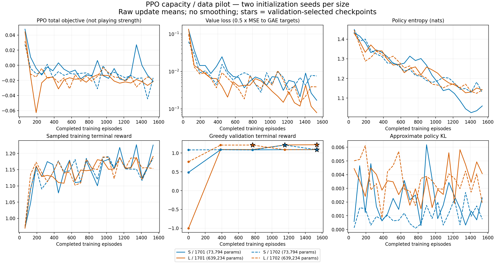
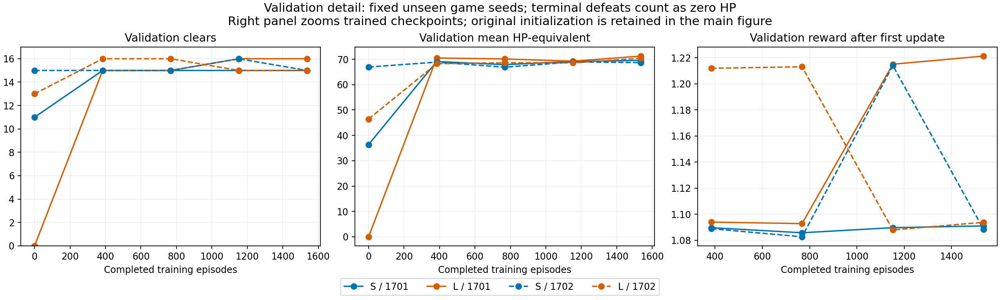
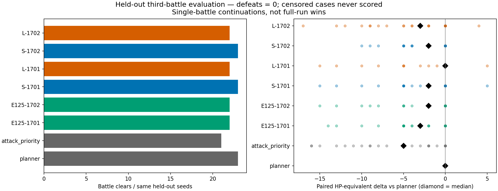

## Hypothesis

Larger PPO actor/critic capacity and more diverse, longer training improve held-out battle resource efficiency; capacity must be isolated from training scale. This is a new, user-requested bounded scaling experiment after E125 failed its continuation gate, not a reinterpretation of E125 success. Include the E126 attack-priority diagnostic as a simple control; E126 itself remains unexecuted.

## Fixed protocol (before any engine evaluation)

Historical v0.111.0 official-engine headless CLI, Ironclad A0. New seed families `e127_20261002_train_00..63`, `val_00..15`, `test_00..23`. Capture each seed's first three naturally reached battles using unchanged E120 macro/battle policy between entries, with legitimate rewards/potions/cards; 90 seconds/700 actions per seed. Never replace seeds or edit game values. If a later entry cannot be reached, preserve it as unavailable, train only on the earlier naturally available entries for that same seed, and report reachability separately. Seed, not entry, is the split/statistical unit. Formal test uses the last available entry among the first three for every selected test seed; same selection rule for validation. No outcome-dependent test selection.

Model S: original 128-state/64-action MLP. Model L: 512-state/256-action MLP. Same E125 feature encoding, terminal reward, Adam and PPO hyperparameters; no reward shaping, expert imitation, planner score, seed or future inputs. Two learner seeds 1701/1702 per size. Each model: 24 updates x 64 complete episodes = 1536 battles (4x E125), cycling each game seed's available battle ordinal by `(update-1 + seed_index) % available_count`. 8 engine workers, CPU Torch single-thread. Maximum 2400 collection/optimization seconds per learner; checkpoint every update, validation at 0/6/12/18/24. Fixed training-error stop: skip the whole affected update, preserve the incomplete episode and stop that learner. A censored initial/validation policy is reported but is not fatal to training; selection requires a fully terminal validation checkpoint. Caps never become defeat/reward zero. Each episode 30 seconds / 120 actions.

Select checkpoint by validation clears, mean reward, earliest tie. Commit selected checkpoint hashes before held-out testing. Test all four selected models, planner, attack-priority and the two fixed E125 policies on the 24 paired entries. Attack-priority: follow planner-nominated potion, otherwise first hand Attack, lowest living target HP/index, otherwise end turn; noncombat selection uses legacy planner. Independently full-prefix replay all new-model test trajectories.

## Decision rule and records

Execution: no real reset/transition/illegal-action errors; all independent replays exact. Strength: both larger models preserve planner clears and median paired HP-equivalent delta >= -2; beat attack-priority with same-or-more clears and median >= +3. Capacity claim additionally requires both paired L models preserve S clears and median >= +2. Defeats score 0 HP-equivalent; censored outcomes have no numeric score and invalidate that pair's aggregate strength claim. No automatic extensions or live-controller promotion. If the gate fails, stop scaling and diagnose representation/reward/value calibration.

Publish training policy/value/total loss, entropy/KL, reward/clear rate, held-out validation reward/HP, wall-time/throughput, final paired results, raw trace hashes and all failed attempts. Two replicates are exploratory, not confidence in general game mastery. Prefix planner prepares the deck/routes; learned policy controls one battle only. No full-run/high-ascension/multicharacter claim. Separate E128 will test inference-time policy/value tree search using frozen selected models; no search-guided training claim.

## Iteration 1 preparation

- Implementation `b928d4d`: six synthetic PPO checks passed (`artifacts/runs/e127-synthetic-v1.log`). No gameplay claim from these checks.
- Fixture collection `b928d4d`: all 104 seeds reached all three entries; 312 frozen entries, no replacement or unavailable entry. 31.284 s wall, 104 raw trace bundles hash-audited.
- Frozen bank committed as `a958d71`; preflight at that SHA: 16 validation entries plus 16 exact independent replays. Planner 15 clears / 1 legitimate defeat, no caps/errors. Audit 32 trace bundles passed. The defeat remains in validation/training selection criteria.
- Optional checkpoint architecture now records widths. Default `ActorCritic()` remains E125-compatible.

## Training v1 and locked selection

Training SHA `803d841` (runnable code loaded before subsequent documentation/plotting commits). All four learners completed 24 updates: 6,144 training battles, 100,932 transitions; no incomplete training episodes, illegal actions or actual reset/transition errors. All 6,464 training + validation trace bundles hash-audited. Eight total synthetic checks passed (six core PPO and two capacity/control checks). The preflight for E128 overlapped part of later training; wall times are measured work costs, not isolated processor benchmarks.

Selected by validation only, committed before any E127 held-out test:

| Size / learner | Parameters | Update | SHA256 |
| --- | ---: | ---: | --- |
| S / 1701 | 73,794 | 24 | 04d3f72a3e656dbaf2f0b63a128deef5194a8c9b4d1f0228973b8fcc0d1d3844 |
| L / 1701 | 639,234 | 24 | bc310bcf3df545b40f459f0583c52273821ade0e885c12c7ab806529b2267cd5 |
| S / 1702 | 73,794 | 18 | 9a0accdea5f9db54f06541c33a70ae480643f4f8713664be8036c497733109ab |
| L / 1702 | 639,234 | 12 | 60df31d914efb2365f2901552a2b17961ecf9f51358f690573546cacc320eb40 |

S-1702 reached 16/16 validation clears at update 18, then regressed to 15/16 at update 24. Both larger models reached 16/16. This corrects an interim verbal summary that looked only at the small models' final checkpoints; no checkpoint selection rule or test protocol changed.

## Held-out result and decision

Test SHA `c076f4b`, 24 preselected unseen game seeds, last of three natural battle entries per seed. All 192 primary evaluations and 96 new-model independent full-prefix replays completed, no caps/actual errors. Every replay matched. Combined preparation/preflight/train/validation/test audit: **6,888 unique raw trace bundles, all hashes valid**. All 100 saved checkpoint hashes verified.

| Arm | Clears / 24 | Median paired HP-equivalent vs planner | Mean paired delta |
| --- | ---: | ---: | ---: |
| Planner | 23 | 0 | 0 |
| Attack priority | 21 | -5 | -6.250 |
| E125 / 1701 | 22 | -3 | -3.708 |
| E125 / 1702 | 22 | -2 | -3.417 |
| S / 1701 | 23 | -2 | -3.292 |
| S / 1702 | 23 | -2 | -2.792 |
| L / 1701 | 22 | 0 | -2.583 |
| L / 1702 | 22 | -3 | -4.375 |

Both scale and capacity gates failed. L has one fewer clear than both planner and corresponding S; median L-minus-S resource delta is zero for each learner. L exceeds attack-priority by one clear, but median resource improvements +2/+1.5 are below the +3 gate. S expanded-training models both gain one clear over E125 on this cohort, but that comparison changes both training data distribution and budget. It is not an isolated training-duration effect. Two training initializations share the same 24 test seeds; there are not 96 independent game seeds.

**Decision:** merge the optional capacity-configurable network, evaluator, plots, diagnostics and reproducible negative evidence; stop this scaling run at its fixed budget and do not promote a larger policy or change the default controller. Continue only the already registered E128 frozen-model inference contrast. Do not interpret the failure as proof PPO cannot work at larger scale.

### What the curves and traces establish

Training + validation wall cost was 1,942.51 s (32.38 min); actual optimizer work 28.99 s (1.49%). This CPU pilot is dominated by collecting/replaying game trajectories, not gradient calculation. Four networks total 6,144 training battles / 100,932 transitions; each network gets 1,536 battles, 4x E125. L is 8.66x the parameters of S. Zero external model API calls; authoring/analysis assistant tokens are not counted as game inference cost.

Training loss and reward improve, but validation is non-monotonic and capacity does not transfer to the held-out cohort. Validation game states are fixed; training batches rotate their battle ordinal, so training reward fluctuations also reflect batch composition. Plots show raw update averages with no smoothing and a separate validation detail panel. HP-equivalent includes terminal defeats as zero, avoiding comparison only among survivors.

On held-out greedy trajectories, MC value MSE was 0.03475 / 0.04216 for S and 0.34644 / 0.41237 for L. This is a diagnostic on different resulting paths, **not** a matched-state causal capacity comparison, and differs from the GAE-target training loss.

`forced-terminal-v1.json` exhaustively lists the six observed defeat endpoints across all four selected models. All six had exactly one legal candidate, end_turn, followed by actual game_over defeat. In `test-09-b3` (Bygone Effigy), L-1701 predicted 0.6896 at HP2/block5/energy0, enemy attack23; L-1702 predicted 1.1321 at HP13/block10/energy0, enemy attack23. Their observed immediate reward is -1. S cleared that battle at HP11, planner at HP13. These establish endpoint critic errors, not which earlier action causally lost the fight. [E130 #246](https://github.com/yzxoi/RSI-Jev-Slay-the-Spire-2/issues/246) separately proposes exact forced-action closure; it has not been run.





## Reproduction

```bash
python3 -m unittest discover -s tests -p 'test_ppo.py' -v
python3 -m unittest discover -s tests -p 'test_ppo_scale.py' -v
python3 scripts/scale_ppo_e127.py freeze --output artifacts/runs/e127-fixtures-v1.json
# Freeze the bank as experiments/E127/fixtures.json before later phases.
python3 scripts/scale_ppo_e127.py preflight --output artifacts/runs/e127-preflight-v1.json
python3 scripts/scale_ppo_e127.py train --preflight artifacts/runs/e127-preflight-v1.json --output artifacts/runs/e127-training-v1.json
# Commit the selected checkpoint hashes before test.
python3 scripts/scale_ppo_e127.py test --training artifacts/runs/e127-training-v1.json --output artifacts/runs/e127-test-v1.json
python3 scripts/analyze_scale_e127.py --output artifacts/runs/e127-analysis-v1.json
python3 scripts/diagnose_value_e127.py --output artifacts/runs/e127-forced-terminal-v1.json
python3 scripts/plot_ppo_research.py --training artifacts/runs/e127-training-v1.json --test artifacts/runs/e127-test-v1.json --output-dir experiments/E127/figures
```

Reports refuse to overwrite evidence. Reproduction requires a fresh output path and separately registered rerun; do not delete old traces. Optional dependencies match E125: Python 3.13.5, torch 2.11.0, numpy 2.3.2; plotting used local Matplotlib. SDK 9.0.318, historical game v0.111.0. Every report embeds exact game/headless/dependency hashes and tested Git SHA. This does not validate the current Steam version, full runs, high ascension, multiple characters or learned deck/reward selection.

Exact training code: `803d841c83f37da955478a741b944b796b781a24`; held-out evaluator: `c076f4bcb5f75eecff6f7fe1b8a6ea874bbd9bba`; exhaustive endpoint diagnostic: `d23e4fe34a6378969eb47948beed96f1ad0cd63a`.
