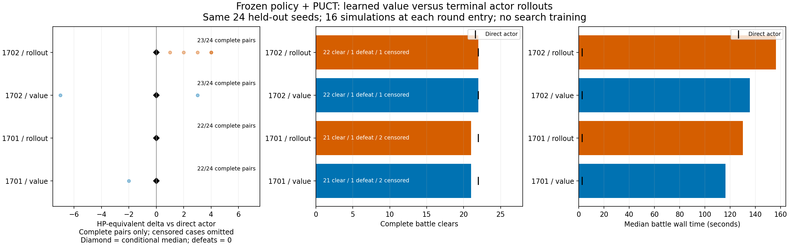
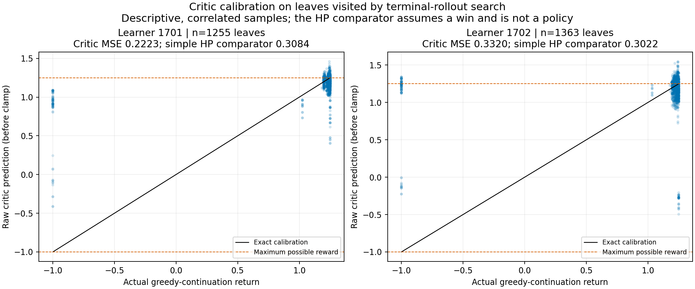

## Hypothesis

A frozen PPO policy prior plus learned value can improve battle decisions with bounded PUCT search; value estimates must be tested against actual policy rollouts, not assumed useful because training MSE falls.

## Fixed experiment

Depends on valid selected E127 checkpoints. Use both L learner seeds 1701/1702 regardless of their relative validation ranking, on every one of the same 24 E127 held-out third/last-available battle entries. This reuses a test cohort for a preregistered inference contrast, not a new independent replication. Freeze this protocol before E127 test outcomes.

Arms per model: direct greedy policy (E127 result), PUCT with learned leaf value, PUCT with greedy actor continuation to terminal. Same frozen actor priors and 16 simulations per root, c_puct=1.5, maximum depth=8 primitive game actions, first-play urgency=parent normalized value; root action chosen by visits, then Q, then prior, then stable candidate index. Normalize reward [-1,1.25] to [0,1]; clamp only nonterminal predictions, never change terminal reward. No alternating-player sign flip in this single-player game. No Dirichlet noise, temperature, hand-written action score or test-selected hyperparameter.

Invoke search only at the first combat_play decision of each new round, for the first six rounds. Other decisions (including generated card selections) use the same greedy actor; a simulation may traverse those selections normally. Each simulated edge runs in a fresh official-engine process from the canonical prefix plus exact observed committed history, with hash checks on every replayed continuation. Cached tree observations are per action path, not merged by partial observable hash; repeated terminal/maximum-depth leaves may be reused without charging an engine reset, but still count as simulations. No snapshots, RNG/HP edits or engine modifications. At most 96 simulations per battle. Each simulation 15 seconds/120 rollout actions, each root 60 seconds, each searched battle 240 seconds/120 executed actions. Four battle workers (at most eight processes counting live and probe); fixed 24 seeds, no replacements.

If any probe hits a cap or actual transition error, mark the search incomplete/error, abort that battle rather than silently substituting a baseline. Retain all traces including failed search; caps are censored, not defeat. Replay each final complete searched trajectory independently from the full prefix, without search, and require all before/after hashes and terminal results to match. Learned policies remain frozen. Search episodes are not fed into PPO; this is not AlphaZero training.

## Measurements and exit

Report exact statuses, paired clears/final HP/potions vs direct policy and planner, root choices/visit counts/Q/priors/depth, search-changed decisions, total wall/reset/inference times. In rollout arm compare predicted leaf value with its exact greedy-continuation return as a diagnostic (different rollout allocation means calibration is not paired across the two tree arms).

Continue toward search-guided training only if BOTH value-search models preserve direct-policy clears and improve median paired HP by >=3; preserve planner clear count and lose no more than median 2 HP; all 48 selected trajectories replay exactly and no execution/cap errors. Prefer neural leaf evaluation over terminal rollouts only if no lower clear count, median HP >= -2 versus rollout search, and median battle wall time <=75% of rollout arm. Fixed budgets, no post-result enlargement. Otherwise preserve negative findings, diagnose critic ranking/coverage or restore overhead, no live default promotion.

## Implementation and preflight protocol

Issue #243. Before test, run synthetic single-player backup/depth/cache checks and a real-engine preflight on fixed validation entries val-00/val-01 with L-1701, both search evaluators, plus exact full-prefix replays. This preflight diagnoses implementation only; no hyperparameter selection. A real error blocks formal test until a separately committed fix and fully recorded repeat. Training is E127; frozen search creates no gradients.

The implementation allows preflight as soon as the preregistered L-1701 learner has completed and selected its final checkpoint, while the independent second learner finishes. Formal test still requires all four valid E127 training runs. Preflight and test must match the exact selected L-1701 record, including weight SHA, widths and update. This changes scheduling only, not search parameters or validation/test inputs.

Preflight checkpoint committed before evaluation: `artifacts/runs/e127-training-v1/L-1701-24.pt`, SHA256 `bc310bcf3df545b40f459f0583c52273821ade0e885c12c7ab806529b2267cd5`. Three synthetic PUCT checks passed at `1c56dde`. Added descriptive calibration against assuming a clear at current HP; this is not a gameplay control and does not change selection or any gate.

## Preflight v1 result

Tested SHA `f879ad2`. Command: `python3 scripts/evaluate_neural_search_e128.py preflight --training artifacts/runs/e127-training-v1/L-1701.json --output artifacts/runs/e128-preflight-v1.json`.

Both evaluators completed both fixed validation battles; all four complete trajectories replayed exactly. 207 trace bundles hash-audited, zero caps/illegal actions/transition errors. Value search final HP 80/70; terminal-rollout search 80/76; the frozen direct actor's existing validation records are 80/61. These two development cases are not strength evidence on held-out test seeds.

Value: 8 searched roots, 111 new-edge probes, 3 changes from actor, depth up to 3, median battle wall 129.48 s. Rollout: 6 roots, 88 probes, 3 changes, depth up to 2, median 111.46 s. Thus faster leaf evaluation does not guarantee faster battles: chosen actions change battle length and the number of future searches. Value restore/probe time 247.66/254.01 s (97.5%); rollout 184.40/217.76 s. Preflight overlapped E127 training, so these timings are descriptive, not a dedicated hardware benchmark. Formal test keeps frozen settings.

Preflight's inherited `inference_seconds: 0` is an uninstrumented callback field, **not zero neural computation**. Before formal test, added read-only timing around every actor/critic evaluation, including simulated states. Formal metric includes feature encoding + tensor preparation + forward; it is deliberately distinguished from E125/E127's forward/preparation-only executed-action metric. Search decisions and budgets are unchanged. Added descriptive preflight calibration: among 83 nonterminal rollout leaves, critic MSE 0.005119 versus 0.0009995 for assuming a clear at current HP; 14/83 predictions exceed the reward range. This is conditioned on two development cases and is not general critic accuracy. Value mode had 33/103 out-of-range predictions; inference already used the preregistered clamp.

## Preserved v1 budget defect and iteration 2 correction

Formal v1 runs at frozen SHA `be4b791a4f066379ecf74996543c6bfa71b2f92c`. In its L-1701 value arm, test-05/test-09 are censored timeouts. `episode` checked its 240-second deadline when sending the next executed action, but an in-progress search callback had only a 60-second root deadline. Consequently test-09 returned after 260.7 seconds. This is a budget-propagation defect, not a legitimate battle defeat; the consumed time is reported as measured. The original v1 job keeps its already loaded code across all four arms, and its results will not be replaced by a successful subset.

Before any follow-up evaluation, iteration 2 passes the parent deadline into every search root and clips process startup/read timeouts to the remaining simulation budget. It does not change priors, values, tree selection, training, seed sets or increase any budget. A synthetic nested-deadline invariant is added. Once v1 has finished, rerun only the fixed validation preflight to check implementation and replay consistency; do not rerun/replace the held-out cohort or claim a passed v1 gate. Engine-process cleanup can add its documented shutdown grace after a timeout.

An accounting correction before that repeat overrides the inherited E127 `engine_workers: 8` metadata with the actual E128 value of **4 battle workers / at most 8 engine processes** and enumerates all time limits. The v1 manifest's inherited worker label is inaccurate; the v1 executor source and fixed protocol both used four workers throughout. `E125_battle` in the generic episode trace's legacy `scope` field denotes the reused episode helper; `experiment: E128`, case, label, checkpoint and code SHA identify this experiment. The legacy `model_calls: 0` counter means external language-model API calls; local neural calls and their measured time are reported separately.

## Formal v1 result

Tested SHA `be4b791a4f066379ecf74996543c6bfa71b2f92c`. Completed the entire fixed cohort: **96 searched battles on 24 shared game seeds**, not 96 independent seeds. Elapsed 3683.70 seconds (61.39 minutes). **Both strength and value-efficiency gates failed.**

| Learner / leaf evaluator | Clear | Defeat | Censored | Median battle seconds | Exact terminal replays |
| --- | ---: | ---: | ---: | ---: | ---: |
| 1701 / value | 21 | 1 | 2 | 116.29 | 22 |
| 1701 / rollout | 21 | 1 | 2 | 130.14 | 22 |
| 1702 / value | 22 | 1 | 1 | 135.83 | 23 |
| 1702 / rollout | 22 | 1 | 1 | 156.40 | 23 |

Direct E127 L actors each cleared 22/24 with two defeats and no caps; median battle time was 2.59/2.62 seconds. Planner cleared 23/24. Search took about 45–60 times the direct median wall time. Timing includes legitimate entry restoration; no external language-model API calls were made. All **90 terminal searched plans replayed exactly**; all **5,880 trace bundles** hash-audited, with no illegal actions, actual transition errors, forced game-over stalls or audit failures. Six timeouts remain censored. L-1701 timed out on test-05/test-09 in both arms; L-1702 on test-09 in both arms. The original v1 budget-propagation defect and measured overshoots are retained above.



Completed-pair observations (exclude censored cases, **not** whole-cohort effect estimates):

| Learner / mode | Complete pairs | HP improved / equal / worse vs direct | Conditional median HP delta | Executed search changes / executed roots |
| --- | ---: | --- | ---: | --- |
| 1701 / value | 22 | 0 / 21 / 1 | 0 | 11 / 92 |
| 1701 / rollout | 22 | 0 / 22 / 0 | 0 | 2 / 92 |
| 1702 / value | 23 | 1 / 21 / 1 | 0 | 17 / 96 |
| 1702 / rollout | 23 | 5 / 18 / 0 | 0 | 6 / 95 |

L-1701 value lost 2 HP on test-12; its rollout arm matched direct on all 22 completed cases. L-1702 value lost 7 HP on test-12 and gained 3 on test-19; rollout gained 1/4/2/3/4 HP on test-00/11/12/19/21. None of these conditional observations recovers the censored outcomes or passes the registered full-cohort gate. All 90 completed search inventories were empty, equal to their corresponding direct-policy inventories. Thirteen of 24 test entries initially carried potions (eleven with one, two with three); this objective has no explicit cross-battle potion reserve value. No resource-preservation or full-run improvement is established.

## What the diagnostics establish

1. **Restoration dominates this implementation.** Value arms used 2,962.37/3,210.64 seconds restoring out of 3,050.70/3,301.25 total probe seconds (both about 97%). In L-1701 value, approximate stage medians were 0.058 seconds to process-ready, 0.865 for start_run, and 1.151 for the remaining canonical prefix/history. A process pool alone is not proof of faster complete restoration. E129 will measure complete exact reset separately.
2. **Search is shallow and often outcome-equivalent.** Each root had a median six legal actions and five visited actions. Most completed roots reached depth 2–3, despite the depth-8 cap. Rollout arms had median visited-edge normalized Q spread near zero / 0.00278. These statistics are consistent with many explored continuations yielding the same outcome; they do not prove that all legal actions are equivalent or that deeper search cannot help.
3. **The critic can misjudge dangerous continuations.** The table below compares each nonterminal rollout leaf prediction to an actual continuation by its own frozen actor. Samples share cases and paths; they are correlated, not independent games. The simple comparator assumes a clear at current HP and is neither a policy nor an oracle. Unlike the two-case preflight, the held-out critic beats that comparator for one learner and loses for the other.

| Learner | Rollout leaves | Critic MSE | Simple HP MSE | Death continuations with positive predicted return | Out-of-reward-range predictions |
| --- | ---: | ---: | ---: | --- | --- |
| 1701 | 1255 | 0.222267 | 0.308377 | 68 / 78 | 296 / 1255 |
| 1702 | 1363 | 0.331966 | 0.302231 | 71 / 84 | 425 / 1363 |



4. **The entry curriculum is mostly easy.** The frozen bank has 192 unique training entries: 191 ordinary Monster and one Elite (Phrog Parasite), floors 2–8. The last-entry validation panel includes one Byrdonis; the test panel one Bygone Effigy, absent from training-entry encounters. This counts entry states, not all later spawned enemies, and does not prove novelty caused a loss. It motivates E131 at fixed capacity and episode budget before further widening.

## Reproduction, versions and iteration record

The official engine/DLL/patch hashes and selected model hashes are in `test-v1.json`; game v0.111.0, pinned headless upstream 084d1aa3d8e118ca7ce8d8774ad16d6be9c92367, .NET 9.0.318, Python 3.13.5, PyTorch 2.11.0, NumPy 2.3.2, Apple M3 Max CPU. Figures use Matplotlib 3.10.5. This is single-battle Ironclad A0 research, with entry decks/routes/rewards prepared by the unchanged planner. It does not evaluate high ascension, other characters, learned reward selection, current Steam compatibility or complete runs.

```bash
python3 scripts/evaluate_neural_search_e128.py test --training artifacts/runs/e127-training-v1.json --direct artifacts/runs/e127-test-v1.json --preflight artifacts/runs/e128-preflight-v1.json --output artifacts/runs/e128-test-v1.json
python3 scripts/analyze_neural_search_e128.py --source artifacts/runs/e128-test-v1.json --direct experiments/E127/test-v1.json --output artifacts/runs/e128-analysis-v1.json
python3 scripts/plot_neural_search_e128.py --source artifacts/runs/e128-test-v1.json --direct experiments/E127/test-v1.json --analysis artifacts/runs/e128-analysis-v1.json --output-dir experiments/E128/figures
```

Formal evaluation remains at be4b791a; later diagnostic/plot commits only read completed traces. Analysis/figures were generated at 0bd335eb52202fd9b251bb1767e41e8c375f39d7. Commit b207d18 fixes nested deadlines, c2102b8 adds the expired-parent no-probe check, and 8eb9d59 corrects worker metadata. Five synthetic PUCT/deadline tests passed. The correction passed the original two-entry validation preflight at clean SHA 0bd335e; it does not replace the held-out v1 results.

## Decision

Reject this configuration for strategy promotion and stop automatic scaling/search-budget increases. Preserve the optional PUCT implementation, exact replay checks, budget correction and negative evidence; no default/live controller change. [E129 #245](https://github.com/yzxoi/RSI-Jev-Slay-the-Spire-2/issues/245), [E130 #246](https://github.com/yzxoi/RSI-Jev-Slay-the-Spire-2/issues/246), and [E131 #247](https://github.com/yzxoi/RSI-Jev-Slay-the-Spire-2/issues/247) are distinct pending proposals, not executed remedies.

## Corrected preflight v2 and final tool decision

Tested clean SHA `0bd335eb52202fd9b251bb1767e41e8c375f39d7`. Command: `python3 scripts/evaluate_neural_search_e128.py preflight --training artifacts/runs/e127-training-v1.json --output artifacts/runs/e128-preflight-v2.json`. All four battles cleared and all four independent trajectory replays matched; 207 trace bundles hash-audited, zero caps/errors/illegal actions. Elapsed 379.46 seconds. Value HP 80/70, rollout 80/76, unchanged from v1. Every complete transition hash and every probe's leaf/final hash, path depth and return also matched v1 (see `preflight-consistency-v2.json`).

The original easy validation cases do not exercise the 240-second cutoff. Deadline behavior is covered separately by synthetic parent-deadline and expired-parent/no-engine-probe checks; engine cleanup may add its documented shutdown grace. No corrected-code held-out strength rerun was performed or claimed. Minor plotting/analysis work overlapped this validation repeat; its timing is descriptive.

Merge the optional research tools and evidence after this successful compatibility check, while rejecting policy promotion. Both registered held-out gates remain failed. Raw traces/models remain local and ignored; public artifacts contain compact outcomes and hashes.
