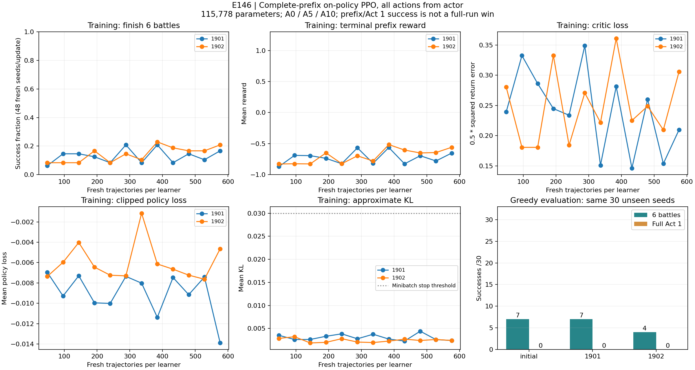

# E146 — Six-battle on-policy PPO pilot

Hypothesis: fresh on-policy credit across six natural battles and all intervening macro decisions improves unknown-seed prefix survival and transfers to first-act progress, unlike isolated-battle PPO. E145 TRAIN-derived 1/3/6-battle coverage was 120/117/15 of120; shorter curricula already saturate. This is a bounded pilot, not a full-run win claim.

Baseline: frozen E140 BC1702 (115,778 parameters; phase encoder unchanged). Two learners 1901/1902 share its actor initialization; reset only the critic output head to zero for the new return target. No teachers/search/BC auxiliary/forced choices. All actions are masked actor samples at temperature1 during training, greedy during evaluation.

Task: start a natural Ironclad run at A0/A5/A10; after six actual battle clears complete pending card/potion rewards and stop at the next live map. Death is -1; success is +1 + .25*HP/maxHP, zero intermediate rewards. No engine setters. Boundary successes are curriculum_clear, never victory. Errors/caps are censored; any incomplete batch stops that learner before gradients.

Fixed training:12 updates x48 new games each x2 learners =1,152 attempts (576 independent game seeds, matched across learners), eight workers CPU. For update u=0..11, difficulty a in0/5/10, i=0..15: seed e146_train_Ironclad_A{a}_u{u:02}_{i:02}; sampling seed learner*1000000+u*48+batch_index. Fresh trajectories only once, 4 PPO epochs. lr1e-4, gamma1, GAE lambda1 for complete Monte Carlo prefix credit, clip.2, minibatch128, entropy.01, value coefficient.5, gradnorm.5, KL early stop.03. Each attempt180s/2400actions, perlearner1200s including collection/updates. Save optimizer/RNG/weights each update, freeze last fully completed checkpoint before DEV. Log preupdate probability parity and macro/combat transition coverage. No checkpoint selection on DEV.

Fixed DEV:30 new seeds e146_dev_Ironclad_A{a}_{00..09}, allthree frozen actors, both six-battle and entire first-act boundary, 180 attempts. Same seeds across arms/horizons are correlated, not180 independent samples. Eight workers,180s/2400actions perattempt,600s total. Replays: i00 eachdifficulty x3actors x2horizons =18. Keep every failure/censor, audit all trace hashes, verify all source/evaluated weights unchanged.

Decision: execution requires complete budgets, finite updates, zero non-neural actions, exact replays and audit. Expand curriculum only if BOTH learners gain >=3/30 six-battle successes over baseline, neither loses >1/10 at any difficulty, and neither lowers first-act clears. Full-act gains reported separately; no default promotion from short-task gains. Otherwise stop this recipe and diagnose, without rerolling seeds/checkpoint cherry-picking. Final330acceptance seeds unused. Historical v0.111.0 CLI only.

Issue [276](https://github.com/yzxoi/RSI-Jev-Slay-the-Spire-2/issues/276). Implementation: optional six-battle live-map boundary with independent replay; sampler records the actual behavior log-probability; pre-update probability/value parity for every collected decision; configurable PPO GAE without changing previous defaults. Zero critic head leaves initial policy identical.

Commands: `python3 -m unittest discover -s tests -p 'test_onpolicy*.py'`; `python3 -m unittest discover -s tests -p test_run_env.py`; `python3 -m unittest discover -s tests -p test_ppo.py`; then, after commit, `python3 scripts/pilot_onpolicy_e146.py train --output artifacts/runs/e146-training-v1.json`. Freeze training metadata in a commit before `python3 scripts/pilot_onpolicy_e146.py evaluate --training experiments/E146/training-v1.json --output artifacts/runs/e146-evaluation-v1.json`.

## Training v1 frozen before DEV

Tested code `a479421` (full SHA/runtime hashes in training-v1.json). Both learners completed all 12 updates: 1,152 natural trajectories on 576 matched base game seeds, 103,127 fresh actor decisions. Every macro phase participates in the return target. All 1,152 trace bundles passed audit; no censors, stale behavior or non-neural actions. Source checkpoint unchanged. Wall time 733.140s. Per-update weights, optimizer/RNG state and raw traces remain under ignored artifacts/runs; hashes published. Last checkpoints frozen now, without DEV selection.

14 relevant synthetic/unit checks passed. Training success rates are not held-out results. All selected seeds/difficulties and failures are retained in training-v1.json. Evaluation not yet run at this commit.

## Held-out result and decision

Evaluation SHA `7602356f0a8f55f2c221290e144cf50000d88a14`, after training/weight freeze. All 180 selected attempts completed at their boundary or natural defeat; zero errors/censors or non-neural actions. All 18 preselected independent replays matched. All 198 evaluation bundles and 1,152 training bundles passed raw hash audit. Evaluated weights unchanged. Evaluation 115.168s; training 733.140s. These are 30 independent DEV game seeds, not 180 independent samples.

| Frozen actor | Six battles A0 /10 | A5 /10 | A10 /10 | Six battles /30 | First-act clears /30 | First-act Boss encounters |
| --- | ---: | ---: | ---: | ---: | ---: | ---: |
| Initial BC1702 | 3 | 2 | 2 | 7 | 0 | 1 |
| PPO1901 | 3 | 2 | 2 | 7 | 0 | 3 |
| PPO1902 | 4 | 0 | 0 | 4 | 0 | 1 |

Paired six-battle outcomes: 1901 gains4/regresses4/ties22; 1902 gains1/regresses4/ties25. All 90 complete-act attempts naturally died; Boss reach is not Boss clear. Training had 157/1,152 curriculum successes (1901:75, 1902:82), 995 defeats, 103,127 fresh actor decisions. Training rewards/critic losses are not independent strength evidence. Pre-update sampled-logprob error <=1.37e-6; 24 updates finite, no KL stop, mean-update KL0.00187–0.00442. CPU optimizer27.62s vs collection700.03s; GPU update-only acceleration remains a small portion of this pipeline.

Execution passes, expansion fails. Merge opt-in on-policy collection/training/boundary infrastructure and all evidence; stop this exact recipe's automatic scale-up, do not replace the default policy. This does not establish that on-policy RL/PPO is generally ineffective. It isolates neither network representation nor critic sharing nor reward horizon individually. E141 rich observations remain untrained in this isolation; the six-battle endpoint omits later deck/potion value. A0–A10 independent full-run acceptance remains unmet and all330 final seeds unused.

Post-hoc compatibility check: all90 paired horizon histories match on their shared prefix, 8,845 command/state pairs. No extra engine rollouts or strength claims. Reproduce with `python3 scripts/audit_onpolicy_horizons_e146.py --evaluation experiments/E146/evaluation-v1.json --output artifacts/runs/e146-horizon-recheck.json`.

Curve command: `python3 scripts/plot_onpolicy_e146.py --training experiments/E146/training-v1.json --evaluation experiments/E146/evaluation-v1.json --output-dir experiments/E146/figures`. Curves are unsmoothed; each training point uses48 new seeds.

