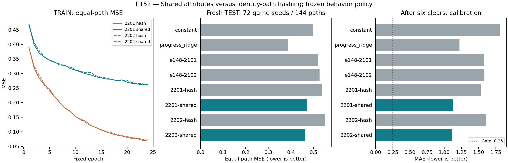

# E152 — Shared attributes for critic generalization

Issue [#288](https://github.com/yzxoi/RSI-Jev-Slay-the-Spire-2/issues/288).

## Hypothesis
E148/E151 exposed severe critic generalization failure not explained by novel item identities. A compact shared-attribute, role-pooled observation (same attributes share channels across card IDs; token-level effect features) reduces memorization and improves frozen-policy return prediction versus the existing identity-path hash representation.

## Fixed experiment
E152 only changes the observation representation within matched new models. Same 545->128->128->1 Tanh MLP (86,529 parameters), two initialization/shuffle seeds 2201/2202, same initial weights within each pair, 24 epochs, Adam3e-4, batch512, norm1, trajectory-balanced MSE, CPU1. Both arms start from identical random trunks and zero value heads because BC input weights are not comparable under a new representation. Both receive explicit task progress/ascension. Compare hash versus shared. Retain frozen E148 task critics as additional practical controls; do not conflate the random-initialized control with E148's BC initialization.

Only original E148 TRAIN216 game seeds /432 paths train either arm. No new target/actor optimization, early stopping, hyperparameter selection, terminal overrides or checkpoint selection. Fresh test seeds e152_test_Ironclad_A{0,5,10}_{000..023}, each two actor sampling streams (144 paths /72 distinct seeds). Sampling seed 152000000+asc*10000+index*10+rep. Freeze weights and baseline coefficients before collecting/scoring fresh test. Same frozen BC1702 behavior actor, full phases, six actual clears after rewards or natural death, original terminal labels. E148 DEV is already inspected and is not fresh test. Final330 acceptance seeds untouched. Three independent replays (each ascension index0 rep0).

## Baselines and gate
TRAIN-fitted constant and fixed alpha.01 progress ridge; frozen E148 task critics; paired newly trained hash controls. Same complete test trajectories for every predictor. Primary MSE is equal-path-weighted, bootstrap clustered by72 game seeds (2,000 resamples seed152). Both shared learners must reduce MSE >=10% vs paired hash, >=5% vs better simple baseline, not exceed paired E148 task MSE, have paired improvement CI upper<0 against hash and the better simple baseline, and no difficulty MSE >110% paired hash. Raw post-six-clear MAE<=.25 on >=10 distinct test seeds. Report phases/endpoints, fit gap and counts. All selected failures/stalls retained; incomplete execution blocks promotion, never replaced. Gate failure stops expansion of this recipe; passing only permits a separate actor/search experiment, never claims improved gameplay.

## Budget / recording
Preprocess180s, fit180s, fresh collection450s (8 engine workers, each180s/2400 actions), score120s. Preserve input/model/tensor/raw hashes and all coherent implementation/repair/result commits. One PR, result comment before merge/close. No visible game actions or overlay. New representation is still lossy and token hashing is not language understanding; this tests a representation package, not each feature's causal effect.


## Representation and causal scope

Both new arms have 540 observation +5 task inputs, exactly86,529 parameters. Shared input keeps20 existing scalars,9 explicit phase indicators,7 resource/context scalars, and seven72-channel role pools:hand,deck,enemies,player powers,owned potions,owned relics,offers. Entity channels include presence,23 shared numeric/categorical properties,16 stat-name hash slots and32 effect/name token hash slots. Fixed role scaling and clipping; no fitted vocabulary/normalization, no outcome input, IDs not used in attribute keys. Pooling preserves multiplicity but loses within-role entity identity and some relations/order. Bundle grouping is lost. Token hashing is not language understanding and does not implement mechanics. The representation package includes previously ignored text attributes and explicit phases; success cannot be attributed to any one component without further ablation.

Fresh TEST is genuinely new and generated only after weights freeze. E148 DEV is not used for fitting or checkpoint selection. Main contrasts share initialization/loss/optimizer/budget; comparison to older E148 critics additionally differs in initialization. Raw values remain unbounded and no task-boundary override is introduced, to keep the comparison about representation.

## Reproduction sequence

```bash
python3 -m unittest discover -s tests -p test_shared_value.py
python3 scripts/probe_shared_value_e152.py plan --output artifacts/runs/e152-plan-v1.json
# Commit the plan before preparation.
python3 scripts/probe_shared_value_e152.py prepare --plan experiments/E152/plan-v1.json --output artifacts/runs/e152-prepared-v1.json
# Commit the prepared manifest before fitting.
python3 scripts/probe_shared_value_e152.py fit --plan experiments/E152/plan-v1.json --prepared experiments/E152/prepared-v1.json --output artifacts/runs/e152-training-v1.json
# Commit final weight hashes before new game collection.
python3 scripts/probe_shared_value_e152.py collect --plan experiments/E152/plan-v1.json --training experiments/E152/training-v1.json --output artifacts/runs/e152-bank-v1.json
# Commit complete fresh bank before scoring.
python3 scripts/probe_shared_value_e152.py score --plan experiments/E152/plan-v1.json --training experiments/E152/training-v1.json --bank experiments/E152/bank-v1.json --output artifacts/runs/e152-evaluation-v1.json
python3 scripts/probe_shared_value_e152.py plot --training experiments/E152/training-v1.json --evaluation experiments/E152/evaluation-v1.json --output experiments/E152/figures
```

All raw arrays, weights and gameplay traces stay under ignored artifacts/runs; public manifests preserve their hashes. Default actor/CLI/native policies are unchanged.


## Results: representation helps point estimates, but the gate fails

All stages completed on the first attempt. Implementation/plan2c45137; preparation65b8e09; fitting56fd61c; frozen weights/collection976abb9; frozen fresh bank/scoringa196cf1; score resultsd0fa43c. Exact full SHAs are in each corresponding manifest. Synthetic identity-shared channels, permutation/index invariance, count preservation, finite-input checks and parameter count:3tests passed. No actor, reward, route or game state edits. Figure visually inspected.

Preparation16.516s,fit14.846s,fresh collection84.801s,score0.326s;sum116.490s (plotting/engineering excluded). M3MaxCPU/one Torch thread;Python3.13.5,torch2.11.0,numpy2.3.2,historicalv0.111.0 with exact engine/DLL/adapter hashes preserved. This does not measure current Steam compatibility.

Same original E148 TRAIN216seed/432paths/38,643decisions. Shared and hash models each86,529parameters,24epochs,two learner seeds. Fresh TEST72game seeds/144paths/12,777decisions,all retained.3independent replays match;147raw bundles pass;237rows on all3preselected replay paths independently reconstruct both encodings exactly. Final actor source hash unchanged by training. There are19six-battle curriculum clears and125defeats (A0 17/48,A5 1/48,A10 1/48);these are the unchanged behavior actor's labels, not new critic gameplay wins. A different seed cohort prevents interpreting19versusE148's18as improvement.

| Predictor | TRAIN MSE | Fresh TEST MSE | Post-six MAE |
| --- | ---: | ---: | ---: |
| Constant |0.4877|0.49718|1.8161|
| Progress ridge |0.4068|**0.38667**|1.2223|
| New2201 hash |0.06838|0.53804|1.5319|
| New2201 shared |0.26316|0.47082|1.1288|
| New2202 hash |0.07171|0.55113|1.6071|
| New2202 shared |0.26021|0.46259|1.1175|
| FrozenE148 task2101 |0.0626|0.52074|1.5791|
| FrozenE148 task2102 |0.0644|0.52617|1.5859|

The matched shared arms reduce TEST point-estimate MSE by12.49%/16.06%, with a smaller TRAIN/TEST gap. Paired72-game-seed bootstrap95% intervals for shared-minus-hash MSE:2201[-0.15308,+0.01340],2202[-0.16505,-0.01523]. Thus only one learner's interval excludes zero; both use the same test games and cannot be counted as independent replications of the seed sample. Against ridge, differences+0.08415/+0.07593 have intervals[+0.00541,+0.16108]/[+0.00153,+0.15359]. Neural models still fail to beat the practical simple baseline.

Per-difficulty shared versus paired hash MSE:

| Difficulty |2201 hash→shared|2202 hash→shared|
| --- | ---: | ---: |
| A0 |1.30324→1.07449|1.31451→1.08949|
| A5 |0.15940→0.21827|0.15947→0.18823|
| A10 |0.15149→0.11968|0.17940→0.11006|

A5 regresses37%/18%, violating the10%guard. Thirtypost-six reward states from19paths/14game seeds have mean true target+1.0827;shared value−0.0433/−0.0313,MAE1.129/1.118,well above0.25. Boundary coverage passes,but calibration does not. Removing post-six states yields MSE0.4720/0.4642 versus hash0.5387/0.5515:the small endpoint subset is not solely responsible for the aggregate gain.

Both learners pass>=10%point gain vs matched hash,not-worse-than-frozenE148 and endpoint coverage. Both fail simple-baseline advantage,combined CI,difficultyguard and endpoint calibration. `expansion_gate=false`.

Decision: merge opt-in encoding/probe/evidence,retain actor/default unchanged;stop expansion of this particular critic recipe. The evidence supports investigating compositional representation but does not prove each component helpful or establish stable value quality. Shared scalars, tokenized text, explicit phases and pooled structure changed together;pooling may also lose important relations. No PPO/search deployment, no full-run improvement claim. E149 real repeated continuation/action-comparison study remains the next already registered independent question;E150 stays conditional. Final330acceptance seeds unused.


